# Voice Alchemy Academy — Course Creation & Curriculum System
## Developer QA Compilation & Code Review Guide

> **Document Version:** 1.0.0  
> **Generated:** August 2026  
> **Scope:** Full Course Creation, Curriculum Builder, Lesson Management, Quiz Generator, Course Player, Database Migrations, and QA Test Suite.  
> **Target Audience:** Fullstack Developers, QA Engineers, and Technical Reviewers.

---

## Table of Contents

1. [Architecture & System Overview](#1-architecture--system-overview)
2. [Data Model & Type Definitions](#2-data-model--type-definitions)
3. [Component & File Index](#3-component--file-index)
4. [Source Code Compilation](#4-source-code-compilation)
   - [4.1 `lib/courses.ts` — Data Layer, Types & Storage Methods](#41-libcoursests)
   - [4.2 `components/course-builder-modal.tsx` — Course & Quiz Builder Modal](#42-componentscourse-builder-modaltsx)
   - [4.3 `components/course-quiz-runner.tsx` — Student Quiz Execution Component](#43-componentscourse-quiz-runnertsx)
   - [4.4 `app/dashboard/courses/page.tsx` — Course Catalog & Teacher Management](#44-appdashboardcoursespagetsx)
   - [4.5 `app/dashboard/courses/[slug]/page.tsx` — Course Player & Lesson Progression](#45-appdashboardcoursesslugpagetsx)
   - [4.6 `supabase/migrations/20260730000001_teacher_courses_system.sql` — Rich Course Schema & RLS](#46-supabasemigrations20260730000001_teacher_courses_systemsql)
   - [4.7 `supabase/migrations/00006_safe_courses.sql` — Safe Base Course & Enrollments Migration](#47-supabasemigrations00006_safe_coursessql)
   - [4.8 `types/database.types.ts` — Database Schema Interfaces](#48-typesdatabasetypests-courses-module-snippet)
5. [Developer QA Checklist & Test Cases](#5-developer-qa-checklist--test-cases)
6. [Known Edge Cases & Recommended Enhancements](#6-known-edge-cases--recommended-enhancements)

---

## 1. Architecture & System Overview

The Course Creation and Curriculum System in Voice Alchemy Academy CRM enables vocal instructors and administrators to compose structured masterclasses with multi-module curricula, individual lessons, practice assignments, and interactive knowledge-check quizzes.

```mermaid
flowchart TD
    subgraph Teacher / Admin Flow
        A[Dashboard: /dashboard/courses] -->|Click '+ Create Course'| B[CourseBuilderModal]
        B -->|Tab 1: Metadata| C[Title, Subtitle, Level, Instructor, Description]
        B -->|Tab 2: Curriculum| D[Add/Edit/Delete Modules]
        D --> E[Add/Edit/Delete Lessons]
        E --> F[Toggle & Build Knowledge Check Quiz]
        F --> G[Add Questions, 4 Options, Correct Answer, Explanation]
        B -->|Click 'Publish'| H[saveCustomCourse in lib/courses.ts]
        H -->|Persist to Storage| I[(Browser LocalStorage / Supabase DB)]
    end

    subgraph Student Learning & Progress Flow
        J[Browse Catalog: /dashboard/courses] -->|Select Active Course| K[Course Player: /dashboard/courses/slug]
        K --> L[Sidebar: Collapsible Section Navigation]
        K --> M[Lesson Viewer: Breakdown, Key Points, Practice]
        M --> N[CourseQuizRunner: Take Lesson Quiz]
        N -->|Grade & Pass 100%| O[Auto-Mark Lesson Complete]
        K -->|Progress Tracker| P[Save Progress to course-progress:slug]
    end
```



### Key Functional Highlights:
1. **Teacher Course Studio Modal (`course-builder-modal.tsx`)**: Two-tab workspace for (1) Metadata & Settings and (2) Modular Curriculum with nested lessons and quiz builders.
2. **Interactive Quiz Creator**: Instructors can toggle optional quizzes on any lesson, specify question prompts, configure 4 choices, select the correct radio answer, and provide pedagogical explanations.
3. **Interactive Quiz Runner (`course-quiz-runner.tsx`)**: Real-time quiz scoring with radio selectors, pass/fail grading badges, correct answer highlighting, and contextual explanations.
4. **Student Course Player (`[slug]/page.tsx`)**: Split-pane player with collapsible section accordion, progress bar, persistent completion tracking, lesson navigation (Prev/Next), and practice checklists.
5. **Database Integration & RLS**: SQL migration scripts support structured JSONB curricula, custom slugs, instructor permissions, and row-level security.

---

## 2. Data Model & Type Definitions

```typescript
export interface QuizQuestion {
  id: string
  question: string
  options: string[]
  correctAnswerIndex: number
  explanation?: string
}

export interface CourseQuiz {
  id: string
  title: string
  description?: string
  questions: QuizQuestion[]
  passingScorePercent?: number
  isOptional?: boolean
}

export interface CourseLesson {
  id: string
  title: string
  duration: string
  summary: string
  body: string[]
  keyPoints: string[]
  practice: string[]
  quiz?: CourseQuiz
}

export interface CourseSection {
  id: string
  title: string
  lessons: CourseLesson[]
  quiz?: CourseQuiz
}

export interface Course {
  slug: string
  title: string
  subtitle: string
  description: string
  level: 'Beginner' | 'Intermediate' | 'Advanced'
  isFree: boolean
  isUnlocked: boolean
  instructor: string
  updatedAt: string
  whatYouWillLearn: string[]
  requirements: string[]
  sections: CourseSection[]
  isCustom?: boolean
}
```

---

## 3. Component & File Index

| File Path | Description | Key Exports / Roles |
|---|---|---|
| `lib/courses.ts` | Data layer, seed courses, and local persistence helper functions | `Course`, `CourseSection`, `CourseLesson`, `CourseQuiz`, `QuizQuestion`, `getCustomCourses`, `saveCustomCourse`, `deleteCustomCourse`, `getAllCourses`, `getCourseBySlug`, `getCourseLessonCount` |
| `components/course-builder-modal.tsx` | Full-featured modal for creating, editing, and publishing courses and quizzes | `CourseBuilderModal` |
| `components/course-quiz-runner.tsx` | Interactive quiz runner for lesson checkpoints with grading & explanations | `CourseQuizRunner` |
| `app/dashboard/courses/page.tsx` | Course listing dashboard with role checks, filter tabs, spotlight tour, and launch CTAs | `CoursesPage` (Default Page Component) |
| `app/dashboard/courses/[slug]/page.tsx` | Masterclass player page with curriculum sidebar, lesson content, progress tracking, and quiz runner | `CoursePlayerPage` (Default Dynamic Route Component) |
| `supabase/migrations/20260730000001_teacher_courses_system.sql` | Postgres SQL migration adding columns, JSONB curriculum, indexes, and RLS policies | PostgreSQL DDL & RLS Policies |
| `supabase/migrations/00006_safe_courses.sql` | Base migration for courses & enrollments tables | PostgreSQL Base Schema & Triggers |
| `types/database.types.ts` | TypeScript database entity definitions for Supabase client | `Course`, `Module`, `Lesson`, `CourseEnrollment` |

---

## 4. Source Code Compilation

### 4.1 `lib/courses.ts`
**Path:** `lib/courses.ts`  
**Purpose:** Course types, seed courses (Beginner Vocal Foundations, Mix Voice, Alt-Pop), and persistence utilities.

```typescript
export interface QuizQuestion {
  id: string
  question: string
  options: string[]
  correctAnswerIndex: number
  explanation?: string
}

export interface CourseQuiz {
  id: string
  title: string
  description?: string
  questions: QuizQuestion[]
  passingScorePercent?: number
  isOptional?: boolean
}

export interface CourseLesson {
  id: string
  title: string
  duration: string
  summary: string
  body: string[]
  keyPoints: string[]
  practice: string[]
  quiz?: CourseQuiz
}

export interface CourseSection {
  id: string
  title: string
  lessons: CourseLesson[]
  quiz?: CourseQuiz
}

export interface Course {
  slug: string
  title: string
  subtitle: string
  description: string
  level: 'Beginner' | 'Intermediate' | 'Advanced'
  isFree: boolean
  isUnlocked: boolean
  instructor: string
  updatedAt: string
  whatYouWillLearn: string[]
  requirements: string[]
  sections: CourseSection[]
  isCustom?: boolean
}

const beginnerVocalCourse: Course = {
  slug: 'beginner-vocal-foundations',
  title: 'Beginner Vocal Foundations',
  subtitle: 'Hindustani pitch discipline for modern alt-pop and indie singers',
  description:
    'A full beginner system based on efficient vocal function: easy onset, breath pacing, clean vowels, drone-led intonation, safe ornament adaptation, and microphone-aware performance.',
  level: 'Beginner',
  isFree: true,
  isUnlocked: true,
  instructor: 'Voice Alchemy Coach',
  updatedAt: 'February 2026',
  whatYouWillLearn: [
    'Build stable coordination before range and power',
    'Use SOVT drills to reduce strain and improve onset consistency',
    'Center pitch with a personal tonic (Sa) and drone practice',
    'Shape resonance and vowels for clear indie tone without squeeze',
    'Adapt meend, murki, and gamak safely for modern pop phrasing',
    'Run a repeatable 15/30/60 minute daily practice structure',
  ],
  requirements: [
    'No prior training required',
    'Quiet space and phone/recording device',
    'Headphones and drone app (recommended)',
    'Water and short daily practice consistency',
  ],
  sections: [
    {
      id: 'foundations',
      title: 'Foundations and Safety',
      lessons: [
        {
          id: 'two-worlds-one-voice',
          title: 'Two Worlds, One Voice: Course Philosophy',
          duration: '11 min',
          summary: 'Why this course blends Hindustani precision with modern CCM styling.',
          body: [
            'This course is designed for contemporary singers who want emotional intimacy and technical reliability at the same time.',
            'The method is simple: efficiency first, expression second, intensity last. We establish easy phonation and repeatability before any aggressive vocal demands.',
            'Hindustani training contributes tonal centering and nuanced note connection. Modern CCM contributes stylistic flexibility, microphone intelligence, and sustainable technique.',
          ],
          keyPoints: [
            'Style has technical consequences',
            'Coordination beats brute force',
            'Relative pitch and note connection are core skills',
          ],
          practice: [
            'Write your current vocal goals in one sentence',
            'Record a 20-second baseline of speaking to singing transition',
          ],
        },
        {
          id: 'anatomy-and-safe-technique',
          title: 'Vocal Anatomy and Non-Negotiable Safety Rules',
          duration: '14 min',
          summary: 'Understand breath, fold vibration, resonance shaping, and healthy boundaries.',
          body: [
            'Voice production depends on coordinated airflow, fold vibration, and tract shaping. Beginners improve fastest when they reduce extra tension and increase consistency.',
            'Pain is a hard stop. Hoarseness after practice is not a badge of effort; it is feedback that load, volume, or technique needs immediate adjustment.',
            'Hydration, rest, and gradual warm-up progression protect tissue quality and support stable vibration.',
          ],
          keyPoints: [
            'No pain during singing',
            'Hoarseness is data, not normal',
            'Gentle warm-up before intensity',
          ],
          practice: [
            'Create a personal stop-sign checklist: pain, tightness, persistent roughness',
            'Track hydration before and after practice for one week',
          ],
          quiz: {
            id: 'quiz-anatomy-safety',
            title: 'Optional Knowledge Check: Vocal Safety',
            description: 'Test your understanding of safe phonation and vocal health boundaries.',
            isOptional: true,
            passingScorePercent: 100,
            questions: [
              {
                id: 'q1',
                question: 'What is the correct response if you feel sharp pain or persistent roughness while singing?',
                options: [
                  'Push through it to build vocal endurance',
                  'Stop immediately, rest, hydrate, and reset technique',
                  'Sing louder to clear the throat',
                  'Switch immediately to whistle register'
                ],
                correctAnswerIndex: 1,
                explanation: 'Pain is a non-negotiable hard stop. Singing through pain causes vocal fold swelling and strain.'
              },
              {
                id: 'q2',
                question: 'What is the core Voice Alchemy progression philosophy?',
                options: [
                  'Intensity first, volume second, pitch last',
                  'Efficiency first, expression second, intensity last',
                  'Belting high notes on day one',
                  'Singing exclusively with throat tension'
                ],
                correctAnswerIndex: 1,
                explanation: 'We always build effortless phonation and coordination before adding expressive ornaments or volume intensity.'
              }
            ]
          },
        },
        {
          id: 'breath-posture-support',
          title: 'Breath, Posture, and Support for Beginners',
          duration: '18 min',
          summary: 'Build a stable physical setup that keeps the throat from overworking.',
          body: [
            'Use a stacked posture: balanced feet, soft knees, neutral ribs/pelvis, easy neck alignment. The goal is organized support, not rigid posing.',
            'Support means matching airflow and pressure to sound demand without throat pressing. Too much air and too much squeeze both destabilize pitch and tone.',
            'Start with silent inhale, hiss pacing, and gentle voiced buzz before any lyric work.',
          ],
          keyPoints: [
            'Stack, do not strain',
            'Steady outflow improves stability',
            'Support is pressure-flow balance',
          ],
          practice: [
            '4 sets of silent inhale + 10-second hiss',
            '6 sets of soft vvv/zzz onset for 3-5 seconds each',
          ],
        },
      ],
    },
    {
      id: 'coordination',
      title: 'Coordination Toolkit',
      lessons: [
        {
          id: 'sovt-reset-toolkit',
          title: 'SOVT Reset Toolkit: Straw, Lip Trill, Hum',
          duration: '16 min',
          summary: 'Use semi-occluded drills to build efficient phonation with lower strain.',
          body: [
            'Semi-occluded vocal tract work helps self-organize the voice by improving source-tract interaction and reducing collision stress.',
            'For beginners, SOVT drills are both warm-up and troubleshooting tools. They are especially useful when onset feels tight or unstable.',
            'Treat SOVT as your reset button between difficult reps, not as a one-time warm-up trick.',
          ],
          keyPoints: [
            'SOVT improves ease and onset',
            'Use low volume and smooth airflow',
            'Reset between reps to avoid pushing',
          ],
          practice: [
            '3 rounds: 30 seconds straw in air + 20 seconds rest',
            '6 lip trill sirens over a small range',
          ],
        },
        {
          id: 'resonance-vowels',
          title: 'Resonance, Placement, and Vowel Shaping',
          duration: '17 min',
          summary: 'Create clear tone color with tract shaping instead of throat force.',
          body: [
            'Resonance is acoustic shaping, not a magical location in the face. Sensations can help, but the real target is efficient setup and consistent sound.',
            'Vowels are your tone steering wheel. Keep diction clear while allowing micro-adjustments as pitch rises so the throat stays free.',
            'For alt-pop and indie style, prioritize clarity and intimacy over loudness.',
          ],
          keyPoints: [
            'Vowel shape controls timbre',
            'Do not lock spoken vowels at high notes',
            'Bright does not have to mean nasal',
          ],
          practice: [
            'Hum to vowel bridge: mm -> meh -> mah',
            'Single-vowel five-note scales at soft volume',
          ],
        },
        {
          id: 'pitch-drone-sa',
          title: 'Pitch Accuracy with Drone and Personal Sa',
          duration: '19 min',
          summary: 'Train repeatable intonation with slow, anchored pitch matching.',
          body: [
            'Choose a tonic that fits your current voice. Relative pitch accuracy matters more than chasing absolute pitch.',
            'Practice with a drone and stepwise patterns. Slow repetition with short holds builds reliable pitch centering.',
            'Use slide-to-center drills as a technical method first, not stylistic decoration.',
          ],
          keyPoints: [
            'Anchor to a comfortable Sa',
            'Hold target pitches to check drift',
            'Repeatability is a core metric',
          ],
          practice: [
            'Drone match: 10 holds of Sa for 2-3 seconds',
            '1-2-3-4-5-4-3-2-1 slow scale, record and review',
          ],
        },
      ],
    },
    {
      id: 'style-and-performance',
      title: 'Style Translation and Performance',
      lessons: [
        {
          id: 'ornaments-safe-adaptation',
          title: 'Hindustani Ornamentation for Pop: Safe Adaptation',
          duration: '20 min',
          summary: 'Translate meend, murki, gamak, and alaap into usable modern phrasing.',
          body: [
            'Ornaments add identity when fundamentals are stable. If straight-tone phrasing is unstable, ornament complexity should be reduced immediately.',
            'Use quiet and controlled versions first. Meend becomes expressive slide, murki becomes short turn, gamak becomes light controlled shake, alaap becomes free-time adlib.',
            'In indie contexts, subtlety usually wins. Precision and emotional timing matter more than speed.',
          ],
          keyPoints: [
            'Earn the ornament with clean base tone',
            'Keep ornaments small and controlled first',
            'Prioritize musical intention over complexity',
          ],
          practice: [
            'Meend drill: slide into target then hold 2 seconds',
            'Murki-lite: 1-2-1 turn at slow tempo',
          ],
        },
        {
          id: 'repertoire-and-song-mapping',
          title: 'Repertoire Selection and Song Mapping',
          duration: '14 min',
          summary: 'Choose songs that develop technique instead of exposing weak coordination.',
          body: [
            'Pick beginner songs by function: narrow range, moderate tempo, sustained vowels, and minimal high-intensity belting demands.',
            'Map lyrics through speak-rhythm -> pitch-speech -> light sing. This bridges articulation into melody while protecting intonation.',
            'Transpose key to your voice early. Staying in your training zone accelerates quality.',
          ],
          keyPoints: [
            'Song choice should match current coordination',
            'Use speak-to-sing transitions',
            'Transposition is a tool, not cheating',
          ],
          practice: [
            'Map one verse in 3 stages: speak, pitch-speak, sing',
            'Test two keys and keep the one with better tone stability',
          ],
        },
        {
          id: 'microphone-and-delivery',
          title: 'Microphone Technique and Delivery Control',
          duration: '12 min',
          summary: 'Use mic distance and angle as part of vocal technique.',
          body: [
            'For intimate pop delivery, consistency of mic distance is critical. Start with a repeatable default distance and adjust intentionally for dynamics.',
            'Use slight off-axis angle and pop filtering to reduce plosives and muddiness.',
            'Let microphone technique handle dynamic contrast so the throat does not need to overcompensate.',
          ],
          keyPoints: [
            'Consistent mic distance improves tone consistency',
            'Manage plosives with angle and filter',
            'Use distance for dynamics, not throat push',
          ],
          practice: [
            'Record one phrase at fixed distance, then with controlled dynamic distance shifts',
            'Compare plosive control on direct-axis vs slight off-axis',
          ],
        },
      ],
    },
    {
      id: 'practice-and-growth',
      title: 'Practice System and Progress',
      lessons: [
        {
          id: 'weekly-systems',
          title: '15/30/60 Minute Practice Systems',
          duration: '15 min',
          summary: 'Run a scalable daily structure that stays sustainable long-term.',
          body: [
            'Use predictable structure: reset, tune, shape, apply, cool down. Consistency beats random intensity.',
            'On high-fatigue days, use a 15-minute reset only. On good days, extend to 30 or 60 minutes with controlled progression.',
            'Keep one measurable win per session so motivation is tied to process quality.',
          ],
          keyPoints: [
            'Short consistent practice is better than sporadic overload',
            'Scale session length to daily readiness',
            'Always finish with cool-down and notes',
          ],
          practice: [
            'Run the 30-minute protocol for 5 consecutive days',
            'Log one technical win and one next-step each day',
          ],
        },
        {
          id: 'troubleshooting-and-milestones',
          title: 'Troubleshooting and Milestone Rubrics',
          duration: '18 min',
          summary: 'Diagnose common issues and track progress with objective criteria.',
          body: [
            'Common beginner issues include breathiness, unstable sustained pitch, high-note strain, and post-practice hoarseness.',
            'Use symptom -> likely cause -> small fix. Start with SOVT, reduced volume, and slower tempo before trying bigger changes.',
            'Track milestone criteria: onset reliability, hiss stability, pitch hold, vowel consistency, and song transfer.',
          ],
          keyPoints: [
            'Diagnose with simple cause/fix logic',
            'Reduce load before adding complexity',
            'Use rubrics for objective progress checks',
          ],
          practice: [
            'Self-grade your week using 5 metrics (1-5 scale)',
            'Choose one weak metric and design a 3-day correction plan',
          ],
        },
      ],
    },
  ],
}

export const courses: Course[] = [
  beginnerVocalCourse,
  {
    slug: 'mix-voice-and-register-control',
    title: 'Mix Voice and Register Control',
    subtitle: 'Coming soon',
    description: 'Locked course',
    level: 'Intermediate',
    isFree: false,
    isUnlocked: false,
    instructor: 'Voice Alchemy Coach',
    updatedAt: 'Coming soon',
    whatYouWillLearn: [],
    requirements: [],
    sections: [],
  },
  {
    slug: 'alt-pop-performance-and-mic-technique',
    title: 'Alt-Pop Performance and Mic Technique',
    subtitle: 'Coming soon',
    description: 'Locked course',
    level: 'Intermediate',
    isFree: false,
    isUnlocked: false,
    instructor: 'Voice Alchemy Coach',
    updatedAt: 'Coming soon',
    whatYouWillLearn: [],
    requirements: [],
    sections: [],
  },
]

const CUSTOM_COURSES_KEY = 'vaaa_custom_courses_v1'

export function getCustomCourses(): Course[] {
  if (typeof window === 'undefined') return []
  try {
    const raw = localStorage.getItem(CUSTOM_COURSES_KEY)
    if (!raw) return []
    return JSON.parse(raw) as Course[]
  } catch (e) {
    console.error('Failed to load custom courses', e)
    return []
  }
}

export function saveCustomCourse(course: Course): Course {
  if (typeof window === 'undefined') return course
  try {
    const current = getCustomCourses()
    const index = current.findIndex((c) => c.slug === course.slug)
    const updated: Course = {
      ...course,
      isCustom: true,
      isUnlocked: true,
      updatedAt: new Date().toLocaleDateString('en-US', { month: 'short', year: 'numeric' }),
    }
    let nextList: Course[]
    if (index >= 0) {
      nextList = [...current]
      nextList[index] = updated
    } else {
      nextList = [updated, ...current]
    }
    localStorage.setItem(CUSTOM_COURSES_KEY, JSON.stringify(nextList))
    return updated
  } catch (e) {
    console.error('Failed to save custom course', e)
    return course
  }
}

export function deleteCustomCourse(slug: string): boolean {
  if (typeof window === 'undefined') return false
  try {
    const current = getCustomCourses()
    const nextList = current.filter((c) => c.slug !== slug)
    localStorage.setItem(CUSTOM_COURSES_KEY, JSON.stringify(nextList))
    return true
  } catch (e) {
    console.error('Failed to delete custom course', e)
    return false
  }
}

export function getAllCourses(): Course[] {
  const custom = getCustomCourses()
  return [...courses, ...custom]
}

export function getCourseBySlug(slug: string): Course | undefined {
  const all = getAllCourses()
  return all.find((course) => course.slug === slug)
}

export function getCourseLessonCount(course: Course): number {
  return course.sections.reduce((sum, section) => sum + section.lessons.length, 0)
}
```

---

### 4.2 `components/course-builder-modal.tsx`
**Path:** `components/course-builder-modal.tsx`  
**Purpose:** Course creation, curriculum structure builder, lesson management, and quiz question editor.

```tsx
'use client'

import React, { useState } from 'react'
import { Course, CourseSection, CourseLesson, CourseQuiz, QuizQuestion, saveCustomCourse } from '@/lib/courses'
import {
  X,
  Plus,
  Trash2,
  HelpCircle,
  Sparkles,
  BookOpen,
  CheckCircle2,
  GraduationCap,
  Layers,
  FileText,
  AlertCircle,
} from 'lucide-react'

interface CourseBuilderModalProps {
  isOpen: boolean
  onClose: () => void
  onCourseCreated: (course: Course) => void
  initialCourse?: Course | null
}

export function CourseBuilderModal({
  isOpen,
  onClose,
  onCourseCreated,
  initialCourse,
}: CourseBuilderModalProps) {
  const [title, setTitle] = useState(initialCourse?.title || '')
  const [subtitle, setSubtitle] = useState(initialCourse?.subtitle || '')
  const [description, setDescription] = useState(initialCourse?.description || '')
  const [level, setLevel] = useState<'Beginner' | 'Intermediate' | 'Advanced'>(
    initialCourse?.level || 'Beginner'
  )
  const [instructor, setInstructor] = useState(initialCourse?.instructor || 'Voice Alchemy Coach')
  const [sections, setSections] = useState<CourseSection[]>(
    initialCourse?.sections || [
      {
        id: 'module-1',
        title: 'Module 1: Foundations & Technique',
        lessons: [
          {
            id: 'lesson-1-1',
            title: 'Lesson 1: Phonation & Onset Ease',
            duration: '12 min',
            summary: 'Master clean phonation onset without vocal fold strain.',
            body: [
              'Build balanced airflow and vocal fold approximation before singing high passages.',
              'Focus on sensation behind the upper teeth rather than pressing in the throat.',
            ],
            keyPoints: ['No throat squeezing', 'Sustained breath support', 'Clean onset vibration'],
            practice: ['3 rounds of 30-second straw sirens', '5 gentle hum-to-vowel transitions'],
            quiz: {
              id: 'quiz-1-1',
              title: 'Module 1 Checkpoint: Vocal Onset',
              description: 'Quick check on breath-flow coordination.',
              isOptional: true,
              passingScorePercent: 100,
              questions: [
                {
                  id: 'q1',
                  question: 'Where should you feel primary acoustic resonance during clean onset?',
                  options: [
                    'Heavy throat pressing at the larynx',
                    'Upper facial mask / hard palate without squeeze',
                    'Clenching the jaw muscles',
                    'Holding all breath in the chest',
                  ],
                  correctAnswerIndex: 1,
                  explanation:
                    'Resonance should vibrate freely through the vocal tract and hard palate, never held under throat pressure.',
                },
              ],
            },
          },
        ],
      },
    ]
  )

  const [activeTab, setActiveTab] = useState<'details' | 'curriculum'>('curriculum')
  const [selectedSectionIdx, setSelectedSectionIdx] = useState(0)

  if (!isOpen) return null

  const handleAddSection = () => {
    const newSectionNum = sections.length + 1
    const newSection: CourseSection = {
      id: `module-${Date.now()}`,
      title: `Module ${newSectionNum}: New Vocal Milestone`,
      lessons: [
        {
          id: `lesson-${Date.now()}`,
          title: 'Lesson 1: Core Technique Drill',
          duration: '15 min',
          summary: 'Overview and execution of this module concept.',
          body: ['Step-by-step vocal breakdown.'],
          keyPoints: ['Focus on resonance clarity', 'Maintain relaxed posture'],
          practice: ['Practice 10 reps of the assigned interval pattern'],
        },
      ],
    }
    setSections([...sections, newSection])
    setSelectedSectionIdx(sections.length)
  }

  const handleRemoveSection = (sectionIdx: number) => {
    if (sections.length <= 1) return
    const next = sections.filter((_, idx) => idx !== sectionIdx)
    setSections(next)
    setSelectedSectionIdx(Math.max(0, sectionIdx - 1))
  }

  const handleAddLesson = (sectionIdx: number) => {
    const currentSec = sections[sectionIdx]
    const newLessonNum = currentSec.lessons.length + 1
    const newLesson: CourseLesson = {
      id: `lesson-${Date.now()}`,
      title: `Lesson ${newLessonNum}: Practice Drill`,
      duration: '10 min',
      summary: 'Practical exercise application.',
      body: ['Detailed breakdown of this exercise.'],
      keyPoints: ['Maintain steady pitch sustain'],
      practice: ['Perform 5 sets of chromatic matching'],
    }
    const nextSections = [...sections]
    nextSections[sectionIdx] = {
      ...currentSec,
      lessons: [...currentSec.lessons, newLesson],
    }
    setSections(nextSections)
  }

  const handleRemoveLesson = (sectionIdx: number, lessonIdx: number) => {
    const currentSec = sections[sectionIdx]
    if (currentSec.lessons.length <= 1) return
    const nextSections = [...sections]
    nextSections[sectionIdx] = {
      ...currentSec,
      lessons: currentSec.lessons.filter((_, idx) => idx !== lessonIdx),
    }
    setSections(nextSections)
  }

  const handleToggleQuiz = (sectionIdx: number, lessonIdx: number) => {
    const currentSec = sections[sectionIdx]
    const currentLesson = currentSec.lessons[lessonIdx]
    const nextSections = [...sections]

    if (currentLesson.quiz) {
      // Remove quiz
      const updated = { ...currentLesson }
      delete updated.quiz
      nextSections[sectionIdx].lessons[lessonIdx] = updated
    } else {
      // Add new optional quiz
      const newQuiz: CourseQuiz = {
        id: `quiz-${Date.now()}`,
        title: `Optional Checkpoint: ${currentLesson.title}`,
        description: 'Test your understanding before moving forward.',
        isOptional: true,
        passingScorePercent: 100,
        questions: [
          {
            id: `q-${Date.now()}`,
            question: 'What is the primary technical objective of this lesson?',
            options: [
              'Singing as loudly as possible with throat pressure',
              'Consistent airflow with effortless phonation',
              'Skipping warmups completely',
              'Singing outside of your safe range',
            ],
            correctAnswerIndex: 1,
            explanation:
              'Always prioritize effortless, sustainable coordination over volume or strain.',
          },
        ],
      }
      nextSections[sectionIdx].lessons[lessonIdx] = {
        ...currentLesson,
        quiz: newQuiz,
      }
    }
    setSections(nextSections)
  }

  const handleAddQuizQuestion = (sectionIdx: number, lessonIdx: number) => {
    const currentSec = sections[sectionIdx]
    const currentLesson = currentSec.lessons[lessonIdx]
    if (!currentLesson.quiz) return

    const newQuestion: QuizQuestion = {
      id: `q-${Date.now()}`,
      question: 'New question topic?',
      options: ['Option A (Correct)', 'Option B', 'Option C', 'Option D'],
      correctAnswerIndex: 0,
      explanation: 'Explanation of why this answer is correct.',
    }

    const nextSections = [...sections]
    nextSections[sectionIdx].lessons[lessonIdx] = {
      ...currentLesson,
      quiz: {
        ...currentLesson.quiz,
        questions: [...currentLesson.quiz.questions, newQuestion],
      },
    }
    setSections(nextSections)
  }

  const handleSaveCourse = () => {
    if (!title.trim()) {
      alert('Please enter a course title')
      return
    }

    const slug =
      initialCourse?.slug ||
      title
        .toLowerCase()
        .replace(/[^a-z0-9]+/g, '-')
        .replace(/(^-|-$)/g, '') ||
      `custom-course-${Date.now()}`

    const newCourse: Course = {
      slug,
      title,
      subtitle: subtitle || 'Custom instructor curriculum',
      description: description || 'Master vocal progress course.',
      level,
      isFree: true,
      isUnlocked: true,
      instructor,
      updatedAt: new Date().toLocaleDateString('en-US', { month: 'short', year: 'numeric' }),
      whatYouWillLearn: [
        'Master customized vocal technique exercises',
        'Learn pitch and register connection',
        'Complete optional module checkpoints and quizzes',
      ],
      requirements: ['No prior experience required', 'Quiet practice space and microphone'],
      sections,
      isCustom: true,
    }

    saveCustomCourse(newCourse)
    onCourseCreated(newCourse)
    onClose()
  }

  const currentSection = sections[selectedSectionIdx] || sections[0]

  return (
    <div className="fixed inset-0 z-[9990] flex items-center justify-center p-2 sm:p-4">
      {/* Dim overlay */}
      <div
        className="fixed inset-0 bg-black/75 backdrop-blur-[2px] transition-opacity"
        onClick={onClose}
      />

      {/* Modal Container */}
      <div className="relative z-[9995] w-full max-w-5xl h-[92dvh] sm:h-[90vh] glass-card-luxe rounded-2xl sm:rounded-3xl border-2 border-[#CEB466]/60 shadow-2xl shadow-black/90 flex flex-col overflow-hidden bg-[#171229]/95 animate-slide-up">
        {/* Modal Header */}
        <div className="p-4 sm:p-6 border-b border-white/[0.08] flex items-center justify-between gap-3 bg-white/[0.02]">
          <div className="flex items-center gap-2.5 sm:gap-3 min-w-0">
            <div className="w-8 h-8 sm:w-10 sm:h-10 rounded-xl sm:rounded-2xl bg-gradient-to-br from-[#CEB466] to-[#9c8644] flex items-center justify-center text-[#171229] shadow-lg shadow-[#CEB466]/20 font-bold flex-shrink-0">
              <GraduationCap className="w-4 h-4 sm:w-5 sm:h-5" />
            </div>
            <div className="min-w-0">
              <h2 className="text-base sm:text-xl font-bold text-white font-luxury truncate">
                {initialCourse ? 'Edit Course' : 'Course & Quiz Studio'}
              </h2>
              <p className="text-[10px] sm:text-xs text-gray-300 hidden xs:block truncate">
                Design vocal courses with optional lesson quizzes
              </p>
            </div>
          </div>

          <div className="flex items-center gap-2 sm:gap-3 flex-shrink-0">
            <button
              onClick={handleSaveCourse}
              className="px-3.5 sm:px-5 py-2 sm:py-2.5 rounded-xl bg-gradient-to-r from-[#CEB466] via-[#e2c974] to-[#CEB466] text-[#171229] font-bold text-xs sm:text-sm shadow-lg shadow-[#CEB466]/20 hover:brightness-110 active:scale-95 transition-all flex items-center gap-1.5"
            >
              <Sparkles className="w-3.5 h-3.5" />
              <span>Publish</span>
            </button>

            <button
              onClick={onClose}
              className="p-1.5 sm:p-2 rounded-xl text-gray-400 hover:text-white hover:bg-white/10 transition-colors"
            >
              <X className="w-4 h-4 sm:w-5 sm:h-5" />
            </button>
          </div>
        </div>

        {/* Tab Navigation */}
        <div className="px-4 sm:px-6 border-b border-white/[0.08] flex items-center gap-3 sm:gap-4 bg-white/[0.01] overflow-x-auto whitespace-nowrap scrollbar-none">
          <button
            onClick={() => setActiveTab('curriculum')}
            className={`py-2.5 sm:py-3 text-xs font-bold border-b-2 transition-all flex items-center gap-2 flex-shrink-0 ${
              activeTab === 'curriculum'
                ? 'border-[#CEB466] text-[#CEB466]'
                : 'border-transparent text-gray-400 hover:text-white'
            }`}
          >
            <Layers className="w-3.5 h-3.5 sm:w-4 sm:h-4" />
            <span>Modules & Quizzes ({sections.length})</span>
          </button>

          <button
            onClick={() => setActiveTab('details')}
            className={`py-2.5 sm:py-3 text-xs font-bold border-b-2 transition-all flex items-center gap-2 flex-shrink-0 ${
              activeTab === 'details'
                ? 'border-[#CEB466] text-[#CEB466]'
                : 'border-transparent text-gray-400 hover:text-white'
            }`}
          >
            <FileText className="w-3.5 h-3.5 sm:w-4 sm:h-4" />
            <span>Metadata & Settings</span>
          </button>
        </div>

        {/* Modal Body */}
        <div className="flex-1 overflow-y-auto p-3.5 sm:p-6 space-y-4 sm:space-y-6">
          {activeTab === 'details' ? (
            /* DETAILS TAB */
            <div className="max-w-2xl space-y-4">
              <div>
                <label className="block text-[11px] sm:text-xs font-bold uppercase text-gray-400 mb-1">
                  Course Title
                </label>
                <input
                  type="text"
                  value={title}
                  onChange={(e) => setTitle(e.target.value)}
                  placeholder="e.g. Mixed Voice Mastery & Range Expansion"
                  className="w-full px-3.5 py-2.5 sm:py-3 rounded-xl bg-white/[0.04] border border-white/10 text-white placeholder-gray-500 text-xs sm:text-sm focus:border-[#CEB466] focus:outline-none"
                />
              </div>

              <div>
                <label className="block text-[11px] sm:text-xs font-bold uppercase text-gray-400 mb-1">
                  Subtitle
                </label>
                <input
                  type="text"
                  value={subtitle}
                  onChange={(e) => setSubtitle(e.target.value)}
                  placeholder="e.g. Eliminate the vocal break and sing with resonant bite"
                  className="w-full px-3.5 py-2.5 sm:py-3 rounded-xl bg-white/[0.04] border border-white/10 text-white placeholder-gray-500 text-xs sm:text-sm focus:border-[#CEB466] focus:outline-none"
                />
              </div>

              <div className="grid grid-cols-1 sm:grid-cols-2 gap-3 sm:gap-4">
                <div>
                  <label className="block text-[11px] sm:text-xs font-bold uppercase text-gray-400 mb-1">
                    Difficulty Level
                  </label>
                  <select
                    value={level}
                    onChange={(e) => setLevel(e.target.value as any)}
                    className="w-full px-3.5 py-2.5 sm:py-3 rounded-xl bg-[#171229] border border-white/10 text-white text-xs sm:text-sm focus:border-[#CEB466] focus:outline-none"
                  >
                    <option value="Beginner">Beginner</option>
                    <option value="Intermediate">Intermediate</option>
                    <option value="Advanced">Advanced</option>
                  </select>
                </div>

                <div>
                  <label className="block text-[11px] sm:text-xs font-bold uppercase text-gray-400 mb-1">
                    Instructor Name
                  </label>
                  <input
                    type="text"
                    value={instructor}
                    onChange={(e) => setInstructor(e.target.value)}
                    placeholder="Coach name"
                    className="w-full px-3.5 py-2.5 sm:py-3 rounded-xl bg-white/[0.04] border border-white/10 text-white text-xs sm:text-sm focus:border-[#CEB466] focus:outline-none"
                  />
                </div>
              </div>

              <div>
                <label className="block text-[11px] sm:text-xs font-bold uppercase text-gray-400 mb-1">
                  Outcome Promise & Overview
                </label>
                <textarea
                  rows={3}
                  value={description}
                  onChange={(e) => setDescription(e.target.value)}
                  placeholder="Describe the vocal transformation students achieve by completing this course..."
                  className="w-full px-3.5 py-2.5 sm:py-3 rounded-xl bg-white/[0.04] border border-white/10 text-white placeholder-gray-500 text-xs sm:text-sm focus:border-[#CEB466] focus:outline-none"
                />
              </div>
            </div>
          ) : (
            /* CURRICULUM TAB (Modules, Lessons, Optional Quizzes) */
            <div className="grid grid-cols-1 md:grid-cols-12 gap-4 sm:gap-6 h-full">
              {/* Left Column: Modules Sidebar */}
              <div className="md:col-span-4 space-y-2.5 sm:space-y-3">
                <div className="flex items-center justify-between">
                  <h3 className="text-[11px] sm:text-xs font-bold uppercase tracking-wider text-gray-400">
                    Modules ({sections.length})
                  </h3>
                  <button
                    onClick={handleAddSection}
                    className="px-2.5 py-1 rounded-lg bg-[#CEB466]/10 hover:bg-[#CEB466]/20 text-[#CEB466] border border-[#CEB466]/30 text-xs font-semibold flex items-center gap-1 transition-colors"
                  >
                    <Plus className="w-3.5 h-3.5" />
                    <span>Add Module</span>
                  </button>
                </div>

                <div className="flex md:flex-col gap-2 overflow-x-auto md:overflow-x-visible pb-2 md:pb-0 scrollbar-none">
                  {sections.map((section, idx) => (
                    <div
                      key={section.id}
                      onClick={() => setSelectedSectionIdx(idx)}
                      className={`p-3 rounded-xl sm:rounded-2xl border transition-all cursor-pointer flex items-center justify-between gap-2 flex-shrink-0 min-w-[200px] md:min-w-0 ${
                        selectedSectionIdx === idx
                          ? 'bg-[#CEB466]/15 border-[#CEB466]/50 text-white shadow-md shadow-[#CEB466]/10'
                          : 'bg-white/[0.02] border-white/[0.06] text-gray-300 hover:bg-white/[0.05]'
                      }`}
                    >
                      <div className="min-w-0">
                        <p className="text-xs font-bold truncate">{section.title}</p>
                        <p className="text-[10px] sm:text-[11px] text-gray-400">
                          {section.lessons.length} Lessons •{' '}
                          {section.lessons.filter((l) => l.quiz).length} Quizzes
                        </p>
                      </div>

                      {sections.length > 1 && (
                        <button
                          onClick={(e) => {
                            e.stopPropagation()
                            handleRemoveSection(idx)
                          }}
                          className="p-1 text-gray-500 hover:text-red-400 transition-colors"
                          title="Delete module"
                        >
                          <Trash2 className="w-3.5 h-3.5" />
                        </button>
                      )}
                    </div>
                  ))}
                </div>
              </div>

              {/* Right Column: Active Module Lessons & Quiz Builder */}
              <div className="md:col-span-8 space-y-5 bg-white/[0.02] p-5 rounded-3xl border border-white/[0.06]">
                {/* Module Title Edit */}
                <div>
                  <label className="block text-xs font-bold uppercase text-gray-400 mb-1">
                    Module Title
                  </label>
                  <input
                    type="text"
                    value={currentSection.title}
                    onChange={(e) => {
                      const next = [...sections]
                      next[selectedSectionIdx].title = e.target.value
                      setSections(next)
                    }}
                    className="w-full px-4 py-2.5 rounded-xl bg-white/[0.04] border border-white/10 text-white font-bold text-base focus:border-[#CEB466] focus:outline-none"
                  />
                </div>

                {/* Lessons in this Module */}
                <div className="space-y-4">
                  <div className="flex items-center justify-between">
                    <h4 className="text-xs font-bold uppercase tracking-wider text-gray-400">
                      Module Lessons ({currentSection.lessons.length})
                    </h4>
                    <button
                      onClick={() => handleAddLesson(selectedSectionIdx)}
                      className="px-3 py-1 rounded-xl bg-white/[0.06] hover:bg-white/[0.12] text-gray-200 text-xs font-semibold flex items-center gap-1 transition-colors"
                    >
                      <Plus className="w-3.5 h-3.5" />
                      <span>Add Lesson</span>
                    </button>
                  </div>

                  <div className="space-y-4">
                    {currentSection.lessons.map((lesson, lIdx) => (
                      <div
                        key={lesson.id}
                        className="p-4 rounded-2xl bg-white/[0.02] border border-white/10 space-y-3"
                      >
                        <div className="flex items-center justify-between gap-3">
                          <div className="flex-1 grid grid-cols-1 sm:grid-cols-3 gap-2">
                            <input
                              type="text"
                              value={lesson.title}
                              onChange={(e) => {
                                const next = [...sections]
                                next[selectedSectionIdx].lessons[lIdx].title = e.target.value
                                setSections(next)
                              }}
                              placeholder="Lesson title"
                              className="sm:col-span-2 px-3 py-1.5 rounded-lg bg-white/[0.04] border border-white/10 text-white text-xs font-bold focus:border-[#CEB466] focus:outline-none"
                            />
                            <input
                              type="text"
                              value={lesson.duration}
                              onChange={(e) => {
                                const next = [...sections]
                                next[selectedSectionIdx].lessons[lIdx].duration = e.target.value
                                setSections(next)
                              }}
                              placeholder="Duration (e.g. 15 min)"
                              className="px-3 py-1.5 rounded-lg bg-white/[0.04] border border-white/10 text-gray-300 text-xs focus:border-[#CEB466] focus:outline-none"
                            />
                          </div>

                          <div className="flex items-center gap-2">
                            {/* Quiz Toggle Button */}
                            <button
                              onClick={() => handleToggleQuiz(selectedSectionIdx, lIdx)}
                              className={`px-2.5 py-1.5 rounded-xl text-xs font-bold flex items-center gap-1 border transition-all ${
                                lesson.quiz
                                  ? 'bg-purple-500/20 text-purple-300 border-purple-500/50 shadow-md shadow-purple-500/10'
                                  : 'bg-white/[0.04] text-gray-400 border-white/10 hover:text-white'
                              }`}
                            >
                              <HelpCircle className="w-3.5 h-3.5" />
                              <span>{lesson.quiz ? 'Quiz Attached' : '+ Add Quiz'}</span>
                            </button>

                            {currentSection.lessons.length > 1 && (
                              <button
                                onClick={() => handleRemoveLesson(selectedSectionIdx, lIdx)}
                                className="p-1.5 text-gray-500 hover:text-red-400 transition-colors"
                                title="Delete lesson"
                              >
                                <Trash2 className="w-3.5 h-3.5" />
                              </button>
                            )}
                          </div>
                        </div>

                        {/* Lesson Summary */}
                        <input
                          type="text"
                          value={lesson.summary}
                          onChange={(e) => {
                            const next = [...sections]
                            next[selectedSectionIdx].lessons[lIdx].summary = e.target.value
                            setSections(next)
                          }}
                          placeholder="Lesson summary statement..."
                          className="w-full px-3 py-1.5 rounded-lg bg-white/[0.02] border border-white/5 text-gray-300 text-xs focus:border-[#CEB466] focus:outline-none"
                        />

                        {/* QUIZ BUILDER PANEL (IF QUIZ ENABLED) */}
                        {lesson.quiz && (
                          <div className="p-4 rounded-2xl bg-purple-950/30 border border-purple-500/30 space-y-4 animate-fade-in">
                            <div className="flex items-center justify-between">
                              <div className="flex items-center gap-2">
                                <span className="px-2 py-0.5 rounded-md bg-purple-500/30 text-purple-300 text-[10px] font-bold uppercase">
                                  Optional Quiz
                                </span>
                                <input
                                  type="text"
                                  value={lesson.quiz.title}
                                  onChange={(e) => {
                                    const next = [...sections]
                                    if (next[selectedSectionIdx].lessons[lIdx].quiz) {
                                      next[selectedSectionIdx].lessons[lIdx].quiz!.title = e.target.value
                                    }
                                    setSections(next)
                                  }}
                                  className="text-xs font-bold text-white bg-transparent border-b border-purple-500/40 focus:outline-none focus:border-purple-300"
                                />
                              </div>

                              <button
                                onClick={() => handleAddQuizQuestion(selectedSectionIdx, lIdx)}
                                className="px-2 py-1 rounded-lg bg-purple-600/30 hover:bg-purple-600/50 text-purple-200 text-[11px] font-semibold flex items-center gap-1 border border-purple-500/30 transition-colors"
                              >
                                <Plus className="w-3 h-3" />
                                <span>Add Question</span>
                              </button>
                            </div>

                            {/* Questions List */}
                            <div className="space-y-3">
                              {lesson.quiz.questions.map((q, qIdx) => (
                                <div
                                  key={q.id}
                                  className="p-3.5 rounded-xl bg-black/40 border border-purple-500/20 space-y-2.5"
                                >
                                  <div className="flex items-center gap-2">
                                    <span className="text-xs text-purple-400 font-bold">
                                      Q{qIdx + 1}:
                                    </span>
                                    <input
                                      type="text"
                                      value={q.question}
                                      onChange={(e) => {
                                        const next = [...sections]
                                        next[selectedSectionIdx].lessons[lIdx].quiz!.questions[
                                          qIdx
                                        ].question = e.target.value
                                        setSections(next)
                                      }}
                                      placeholder="Question prompt..."
                                      className="w-full px-2.5 py-1 rounded-md bg-white/[0.04] border border-white/10 text-white text-xs focus:border-purple-400 focus:outline-none"
                                    />
                                  </div>

                                  {/* 4 Options with Radio Selector */}
                                  <div className="grid grid-cols-1 sm:grid-cols-2 gap-2">
                                    {q.options.map((opt, optIdx) => (
                                      <div
                                        key={optIdx}
                                        className="flex items-center gap-2 px-2.5 py-1 rounded-lg bg-white/[0.02] border border-white/5"
                                      >
                                        <input
                                          type="radio"
                                          name={`q-${lesson.id}-${qIdx}`}
                                          checked={q.correctAnswerIndex === optIdx}
                                          onChange={() => {
                                            const next = [...sections]
                                            next[selectedSectionIdx].lessons[lIdx].quiz!.questions[
                                              qIdx
                                            ].correctAnswerIndex = optIdx
                                            setSections(next)
                                          }}
                                          className="text-purple-500 focus:ring-purple-400"
                                          title="Mark as correct answer"
                                        />
                                        <input
                                          type="text"
                                          value={opt}
                                          onChange={(e) => {
                                            const next = [...sections]
                                            next[selectedSectionIdx].lessons[lIdx].quiz!.questions[
                                              qIdx
                                            ].options[optIdx] = e.target.value
                                            setSections(next)
                                          }}
                                          className={`w-full bg-transparent text-xs focus:outline-none ${
                                            q.correctAnswerIndex === optIdx
                                              ? 'text-emerald-400 font-semibold'
                                              : 'text-gray-300'
                                          }`}
                                        />
                                      </div>
                                    ))}
                                  </div>

                                  {/* Explanation */}
                                  <input
                                    type="text"
                                    value={q.explanation || ''}
                                    onChange={(e) => {
                                      const next = [...sections]
                                      next[selectedSectionIdx].lessons[lIdx].quiz!.questions[
                                        qIdx
                                      ].explanation = e.target.value
                                      setSections(next)
                                    }}
                                    placeholder="Explanation shown when graded..."
                                    className="w-full px-2 py-1 rounded-md bg-white/[0.02] border border-white/5 text-gray-400 text-[11px] focus:outline-none focus:border-purple-400"
                                  />
                                </div>
                              ))}
                            </div>
                          </div>
                        )}
                      </div>
                    ))}
                  </div>
                </div>
              </div>
            </div>
          )}
        </div>
      </div>
    </div>
  )
}
```

---

### 4.3 `components/course-quiz-runner.tsx`
**Path:** `components/course-quiz-runner.tsx`  
**Purpose:** Interactive quiz taking component with instant grading, state management, and score feedback.

```tsx
'use client'

import React, { useState } from 'react'
import { CourseQuiz } from '@/lib/courses'
import { CheckCircle2, XCircle, HelpCircle, RotateCcw, Sparkles } from 'lucide-react'

interface CourseQuizRunnerProps {
  quiz: CourseQuiz
  onComplete?: (scorePercent: number) => void
}

export function CourseQuizRunner({ quiz, onComplete }: CourseQuizRunnerProps) {
  const [selectedAnswers, setSelectedAnswers] = useState<Record<number, number>>({})
  const [submitted, setSubmitted] = useState(false)
  const [isExpanded, setIsExpanded] = useState(true)

  const totalQuestions = quiz.questions.length

  const handleSelectOption = (questionIndex: number, optionIndex: number) => {
    if (submitted) return
    setSelectedAnswers((prev) => ({
      ...prev,
      [questionIndex]: optionIndex,
    }))
  }

  const handleGradeQuiz = () => {
    setSubmitted(true)
    const correct = quiz.questions.reduce((count, q, idx) => {
      return selectedAnswers[idx] === q.correctAnswerIndex ? count + 1 : count
    }, 0)
    const percent = Math.round((correct / totalQuestions) * 100)
    if (onComplete) {
      onComplete(percent)
    }
  }

  const handleReset = () => {
    setSelectedAnswers({})
    setSubmitted(false)
  }

  const answeredCount = Object.keys(selectedAnswers).length
  const correctCount = quiz.questions.reduce((count, q, idx) => {
    return selectedAnswers[idx] === q.correctAnswerIndex ? count + 1 : count
  }, 0)
  const scorePercent = totalQuestions > 0 ? Math.round((correctCount / totalQuestions) * 100) : 0
  const isPassed = scorePercent >= (quiz.passingScorePercent || 70)

  return (
    <div className="glass-card-subtle rounded-3xl border border-purple-500/30 overflow-hidden mt-6 bg-purple-950/20">
      {/* Header */}
      <div
        onClick={() => setIsExpanded(!isExpanded)}
        className="p-5 sm:p-6 bg-gradient-to-r from-purple-900/30 via-indigo-900/20 to-transparent border-b border-purple-500/20 flex items-center justify-between cursor-pointer hover:bg-white/[0.03] transition-colors"
      >
        <div className="flex items-center gap-3">
          <div className="w-10 h-10 rounded-2xl bg-gradient-to-br from-purple-500 to-indigo-600 flex items-center justify-center text-white shadow-lg shadow-purple-500/20">
            <HelpCircle className="w-5 h-5" />
          </div>
          <div>
            <div className="flex items-center gap-2">
              <span className="px-2.5 py-0.5 rounded-full bg-purple-500/20 text-purple-300 border border-purple-500/30 text-[10px] font-bold uppercase tracking-wider">
                Optional Quiz
              </span>
              {submitted && (
                <span
                  className={`px-2.5 py-0.5 rounded-full text-[10px] font-bold border ${
                    isPassed
                      ? 'bg-green-500/20 text-green-300 border-green-500/40'
                      : 'bg-amber-500/20 text-amber-300 border-amber-500/40'
                  }`}
                >
                  {isPassed ? 'Passed' : 'Review & Retry'}
                </span>
              )}
            </div>
            <h3 className="text-base sm:text-lg font-bold text-white font-luxury mt-1">
              {quiz.title}
            </h3>
          </div>
        </div>

        <div className="flex items-center gap-2">
          {submitted ? (
            <div className="flex items-center gap-2">
              <span className="text-xs font-mono text-gray-300">
                Score: <strong className="text-white">{correctCount}/{totalQuestions}</strong> ({scorePercent}%)
              </span>
            </div>
          ) : (
            <span className="text-xs text-gray-400 font-mono">
              {answeredCount}/{totalQuestions} Answered
            </span>
          )}
        </div>
      </div>

      {/* Questions List */}
      {isExpanded && (
        <div className="p-4 sm:p-6 space-y-6">
          {quiz.questions.map((q, qIdx) => {
            const selectedIdx = selectedAnswers[qIdx]
            const isAnswered = selectedIdx !== undefined
            const isCorrect = isAnswered && selectedIdx === q.correctAnswerIndex

            return (
              <div
                key={q.id || qIdx}
                className={`p-4 sm:p-5 rounded-2xl border transition-all ${
                  submitted
                    ? isCorrect
                      ? 'bg-green-500/[0.04] border-green-500/30'
                      : 'bg-red-500/[0.04] border-red-500/30'
                    : 'bg-white/[0.02] border-white/[0.06]'
                }`}
              >
                {/* Question Prompt */}
                <div className="flex items-start gap-3 mb-3">
                  <span className="w-6 h-6 rounded-lg bg-white/[0.08] text-[#CEB466] font-mono text-xs font-bold flex items-center justify-center shrink-0 mt-0.5">
                    {qIdx + 1}
                  </span>
                  <p className="text-sm sm:text-base font-medium text-white leading-relaxed">
                    {q.question}
                  </p>
                </div>

                {/* Options */}
                <div className="grid grid-cols-1 sm:grid-cols-2 gap-2.5 ml-0 sm:ml-9">
                  {q.options.map((option, optIdx) => {
                    const isSelected = selectedIdx === optIdx
                    const isThisCorrect = optIdx === q.correctAnswerIndex

                    let optionStyle =
                      'bg-white/[0.03] text-gray-300 border-white/[0.08] hover:bg-white/[0.07] hover:border-white/20'

                    if (submitted) {
                      if (isThisCorrect) {
                        optionStyle = 'bg-green-500/20 text-green-200 border-green-500/60 font-semibold'
                      } else if (isSelected && !isThisCorrect) {
                        optionStyle = 'bg-red-500/20 text-red-200 border-red-500/60 line-through opacity-80'
                      } else {
                        optionStyle = 'bg-white/[0.02] text-gray-500 border-white/[0.04] opacity-50'
                      }
                    } else if (isSelected) {
                      optionStyle = 'bg-purple-500/20 text-purple-200 border-purple-500/60 font-semibold shadow-md shadow-purple-500/10'
                    }

                    return (
                      <button
                        key={optIdx}
                        type="button"
                        onClick={() => handleSelectOption(qIdx, optIdx)}
                        className={`p-3 rounded-xl border text-xs sm:text-sm text-left transition-all flex items-center justify-between gap-2 ${optionStyle}`}
                      >
                        <span>{option}</span>
                        {submitted && isThisCorrect && (
                          <CheckCircle2 className="w-4 h-4 text-green-400 shrink-0" />
                        )}
                        {submitted && isSelected && !isThisCorrect && (
                          <XCircle className="w-4 h-4 text-red-400 shrink-0" />
                        )}
                      </button>
                    )
                  })}
                </div>

                {/* Explanation Card */}
                {submitted && q.explanation && (
                  <div className="mt-3.5 sm:ml-9 p-3 rounded-xl bg-white/[0.03] border border-white/[0.06] text-xs text-gray-300 leading-relaxed">
                    <strong className="text-[#CEB466]">Explanation: </strong>
                    {q.explanation}
                  </div>
                )}
              </div>
            )
          })}

          {/* Footer Grade Button */}
          <div className="pt-2 border-t border-white/[0.08] flex flex-col sm:flex-row items-center justify-between gap-3">
            {submitted ? (
              <div className="flex items-center gap-3">
                <button
                  type="button"
                  onClick={handleReset}
                  className="px-4 py-2.5 rounded-xl bg-white/[0.06] hover:bg-white/[0.12] text-gray-300 hover:text-white text-xs font-semibold transition-all flex items-center gap-1.5"
                >
                  <RotateCcw className="w-3.5 h-3.5" />
                  <span>Retry Quiz</span>
                </button>
                <span className="text-xs text-gray-400">
                  {isPassed ? 'Great job! Concept mastered.' : 'Review explanations above and retry!'}
                </span>
              </div>
            ) : (
              <button
                type="button"
                onClick={handleGradeQuiz}
                disabled={answeredCount === 0}
                className={`px-6 py-2.5 rounded-xl text-xs font-bold transition-all shadow-lg flex items-center gap-2 ${
                  answeredCount === totalQuestions
                    ? 'bg-gradient-to-r from-purple-500 to-indigo-600 hover:from-purple-400 hover:to-indigo-500 text-white shadow-purple-500/25 cursor-pointer'
                    : 'bg-white/10 text-gray-400 border border-white/10 cursor-pointer hover:bg-white/15 hover:text-white'
                }`}
              >
                <Sparkles className="w-3.5 h-3.5" />
                <span>
                  Check Answers ({answeredCount}/{totalQuestions})
                </span>
              </button>
            )}
          </div>
        </div>
      )}
    </div>
  )
}
```

---

### 4.4 `app/dashboard/courses/page.tsx`
**Path:** `app/dashboard/courses/page.tsx`  
**Purpose:** Course catalog listing, teacher onboarding spotlight tour, custom course filter, edit & delete controls.

```tsx
'use client'

import { useState, useEffect } from 'react'
import Link from 'next/link'
import {
  GraduationCap,
  Lock,
  PlayCircle,
  Sparkles,
  CheckCircle2,
  Clock,
  Award,
  Zap,
  ChevronRight,
  Plus,
  Edit3,
  Trash2,
  HelpCircle,
  BookOpen,
} from 'lucide-react'
import { courses as defaultCourses, getCourseLessonCount, Course, getAllCourses, deleteCustomCourse } from '@/lib/courses'
import { CourseBuilderModal } from '@/components/course-builder-modal'
import { SpotlightTour, SpotlightTriggerButton, SpotlightStep } from '@/components/spotlight-tour'
import { createClient } from '@/lib/supabase'

interface CourseOutcomeMeta {
  slug: string
  outcomePromise: string
  practiceMinutesNeeded: number
  progressPercent: number
  checkpointCount: number
  isTeacherRecommended?: boolean
  transformationStory?: string
}

const COURSE_META: Record<string, CourseOutcomeMeta> = {
  'beginner-vocal-foundations': {
    slug: 'beginner-vocal-foundations',
    outcomePromise: 'Build effortless vocal coordination, eliminate throat squeeze, and center pitch with Hindustani drone discipline.',
    practiceMinutesNeeded: 120,
    progressPercent: 45,
    checkpointCount: 3,
    isTeacherRecommended: true,
    transformationStory: '“In 2 weeks, my voice stopped getting tired after high notes. The SOVT exercises changed everything.” — Elena R.',
  },
  'mix-voice-and-register-control': {
    slug: 'mix-voice-and-register-control',
    outcomePromise: 'Bridge chest and head registers seamlessly across your passaggio. Eliminate voice cracks and sing with acoustic bite above C4.',
    practiceMinutesNeeded: 180,
    progressPercent: 0,
    checkpointCount: 4,
    isTeacherRecommended: true,
    transformationStory: '“Gained 4 semitones of usable, belting head-mix range without pushing volume.” — Marcus V.',
  },
  'alt-pop-performance-and-mic-technique': {
    slug: 'alt-pop-performance-and-mic-technique',
    outcomePromise: 'Master contemporary intimacy, vocal fry onsets, breath control, and studio microphone dynamics.',
    practiceMinutesNeeded: 150,
    progressPercent: 0,
    checkpointCount: 4,
    transformationStory: '“Learned how to sing with delicate emotion while maintaining sustainable cord closure.” — Sarah J.',
  },
}

const teacherCourseTourSteps: SpotlightStep[] = [
  {
    target: '[data-tour="course-builder-btn"]',
    title: '1. Custom Course & Quiz Builder',
    content: 'Create fully customized vocal courses for your students. Add modules, lessons, and optional interactive quizzes with multiple-choice questions and instant explanations.',
    placement: 'bottom',
  },
  {
    target: '[data-tour="course-list-grid"]',
    title: '2. Vocal Curriculum & Progress Paths',
    content: 'View built-in academy courses and your custom published courses. Students can step through lessons, take optional quizzes, and track completion.',
    placement: 'top',
  },
]

export default function CoursesPage() {
  const [courseList, setCourseList] = useState<Course[]>(defaultCourses)
  const [isBuilderOpen, setIsBuilderOpen] = useState(false)
  const [editingCourse, setEditingCourse] = useState<Course | null>(null)
  const [filter, setFilter] = useState<'all' | 'custom'>('all')
  const [isTeacher, setIsTeacher] = useState(false)

  const refreshCourses = () => {
    setCourseList(getAllCourses())
  }

  useEffect(() => {
    refreshCourses()

    // Check user role
    const supabase = createClient()
    supabase.auth.getUser().then(async ({ data: { user } }) => {
      if (user) {
        const { data: profile } = await supabase
          .from('profiles')
          .select('role')
          .eq('id', user.id)
          .single()

        const role = profile?.role
        const teacherRole = role === 'teacher' || role === 'instructor' || role === 'admin'
        setIsTeacher(teacherRole)
      }
    })
  }, [])

  const handleCourseCreated = () => {
    refreshCourses()
  }

  const handleDeleteCourse = (slug: string, e: React.MouseEvent) => {
    e.stopPropagation()
    if (confirm('Are you sure you want to delete this custom course?')) {
      deleteCustomCourse(slug)
      refreshCourses()
    }
  }

  const handleEditCourse = (course: Course, e: React.MouseEvent) => {
    e.stopPropagation()
    setEditingCourse(course)
    setIsBuilderOpen(true)
  }

  const displayedCourses =
    filter === 'custom' ? courseList.filter((c) => c.isCustom) : courseList

  const totalLessons = courseList.reduce((sum, c) => sum + getCourseLessonCount(c), 0)

  return (
    <div className="p-3 sm:p-6 lg:p-8 space-y-6 sm:space-y-8 max-w-7xl mx-auto">
      {/* On-page spotlight tour (Teacher Only) */}
      {isTeacher && <SpotlightTour tourKey="teacher_course_builder_v4" steps={teacherCourseTourSteps} />}

      {/* Header */}
      <section className="glass-card-luxe rounded-2xl sm:rounded-3xl border border-[#CEB466]/40 p-4 sm:p-6 md:p-8 relative overflow-hidden">
        <div className="flex flex-col md:flex-row md:items-center justify-between gap-4 sm:gap-6 relative z-10">
          <div>
            <div className="inline-flex items-center gap-2 px-3 py-1 rounded-full bg-[#CEB466]/15 border border-[#CEB466]/30 text-[10px] sm:text-xs font-semibold text-[#CEB466] mb-2">
              <GraduationCap className="w-3.5 h-3.5" />
              <span>Voice Alchemy Master Curriculum</span>
            </div>
            <h1 className="text-2xl sm:text-3xl md:text-4xl font-bold text-white font-luxury">
              {isTeacher ? 'Vocal Progress Paths & Course Studio' : 'Vocal Progress Paths'}
            </h1>
            <p className="text-xs sm:text-sm text-gray-300 mt-1 max-w-2xl leading-relaxed">
              {isTeacher
                ? 'Outcome-based vocal transformation paths. Build custom courses, add optional module quizzes, and guide students through step-by-step masterclasses.'
                : 'Outcome-based vocal transformation paths. Complete guided lessons, record checkpoint takes, and take optional quizzes to level up your vocal technique.'}
            </p>
          </div>

          {/* Teacher Action Controls */}
          {isTeacher && (
            <div className="flex flex-wrap items-center gap-2.5 sm:gap-3 shrink-0">
              <SpotlightTriggerButton tourKey="teacher_course_builder_v4" label="How to" />

              <button
                data-tour="course-builder-btn"
                onClick={() => {
                  setEditingCourse(null)
                  setIsBuilderOpen(true)
                }}
                className="w-full sm:w-auto py-2.5 sm:py-3 px-4 sm:px-5 rounded-xl sm:rounded-2xl bg-gradient-to-r from-[#CEB466] via-[#e2c974] to-[#CEB466] text-[#171229] font-bold text-xs sm:text-sm shadow-xl shadow-[#CEB466]/20 hover:brightness-110 active:scale-95 transition-all flex items-center justify-center gap-2"
              >
                <Plus className="w-4 h-4" />
                <span>+ Create Course & Quizzes</span>
              </button>
            </div>
          )}
        </div>

        {/* Filter bar */}
        <div className="mt-4 sm:mt-6 pt-4 sm:pt-6 border-t border-white/[0.08] flex flex-wrap items-center justify-between gap-3">
          <div className="flex flex-wrap items-center gap-2">
            {isTeacher ? (
              <>
                <button
                  onClick={() => setFilter('all')}
                  className={`px-3 py-1.5 rounded-xl text-xs font-bold transition-all ${
                    filter === 'all'
                      ? 'bg-[#CEB466] text-[#171229] shadow-md shadow-[#CEB466]/20'
                      : 'bg-white/[0.05] text-gray-300 hover:bg-white/10'
                  }`}
                >
                  All Courses ({courseList.length})
                </button>
                <button
                  onClick={() => setFilter('custom')}
                  className={`px-3 py-1.5 rounded-xl text-xs font-bold transition-all flex items-center gap-1.5 ${
                    filter === 'custom'
                      ? 'bg-[#CEB466] text-[#171229] shadow-md shadow-[#CEB466]/20'
                      : 'bg-white/[0.05] text-gray-300 hover:bg-white/10'
                  }`}
                >
                  <Sparkles className="w-3.5 h-3.5" />
                  <span>Teacher Created ({courseList.filter((c) => c.isCustom).length})</span>
                </button>
              </>
            ) : (
              <span className="text-xs font-semibold text-gray-300">
                {displayedCourses.length} Masterclasses Available
              </span>
            )}
          </div>

          <span className="text-xs text-gray-400 font-mono hidden sm:inline">
            {totalLessons} Total Lessons
          </span>
        </div>
      </section>

      {/* Courses Grid */}
      <section data-tour="course-list-grid" className="grid grid-cols-1 md:grid-cols-2 lg:grid-cols-3 gap-6">
        {displayedCourses.map((course) => {
          const lessonCount = getCourseLessonCount(course)
          const meta = COURSE_META[course.slug] || {
            slug: course.slug,
            outcomePromise: course.description,
            practiceMinutesNeeded: 120,
            progressPercent: 0,
            checkpointCount: course.sections.length,
          }

          const isUnlocked = course.isUnlocked
          const quizCount = course.sections.reduce(
            (sum, s) => sum + (s.quiz ? 1 : 0) + s.lessons.filter((l) => l.quiz).length,
            0
          )

          return (
            <div
              key={course.slug}
              className={`glass-card-subtle rounded-3xl border p-6 flex flex-col justify-between transition-all duration-300 ${
                isUnlocked
                  ? 'border-white/[0.1] hover:border-[#CEB466]/50 hover:bg-white/[0.06] shadow-xl'
                  : 'border-white/[0.06] bg-white/[0.02] opacity-85 hover:opacity-100 hover:border-purple-500/40'
              }`}
            >
              <div className="space-y-4">
                {/* Badges & Status */}
                <div className="flex items-center justify-between">
                  <div className="flex items-center gap-2">
                    <span
                      className={`px-3 py-1 rounded-full text-xs font-bold border ${
                        course.isCustom
                          ? 'bg-[#CEB466]/20 text-[#CEB466] border-[#CEB466]/40'
                          : isUnlocked
                          ? 'bg-emerald-500/20 text-emerald-300 border-emerald-500/30'
                          : 'bg-white/10 text-gray-300 border-white/15'
                      }`}
                    >
                      {course.isCustom ? 'Teacher Created' : isUnlocked ? 'Unlocked & Active' : 'Roadmap Milestone'}
                    </span>

                    {quizCount > 0 && (
                      <span className="px-2 py-0.5 rounded-full bg-purple-500/20 text-purple-300 border border-purple-500/30 text-[10px] font-bold flex items-center gap-1">
                        <HelpCircle className="w-3 h-3" />
                        <span>{quizCount} {quizCount === 1 ? 'Quiz' : 'Quizzes'}</span>
                      </span>
                    )}
                  </div>

                  {isTeacher && course.isCustom ? (
                    <div className="flex items-center gap-1">
                      <button
                        onClick={(e) => handleEditCourse(course, e)}
                        className="p-1.5 text-gray-400 hover:text-[#CEB466] transition-colors rounded-lg hover:bg-white/5"
                        title="Edit course"
                      >
                        <Edit3 className="w-3.5 h-3.5" />
                      </button>
                      <button
                        onClick={(e) => handleDeleteCourse(course.slug, e)}
                        className="p-1.5 text-gray-400 hover:text-red-400 transition-colors rounded-lg hover:bg-white/5"
                        title="Delete course"
                      >
                        <Trash2 className="w-3.5 h-3.5" />
                      </button>
                    </div>
                  ) : (
                    !isUnlocked && <Lock className="w-4 h-4 text-purple-400" />
                  )}
                </div>

                {/* Course Title & Level */}
                <div>
                  <div className="flex items-center justify-between text-xs text-gray-400 mb-1">
                    <span className="font-semibold text-[#CEB466] uppercase tracking-wider">{course.level} Level</span>
                    <span>{lessonCount} Lessons</span>
                  </div>
                  <h3 className="text-xl font-bold text-white font-luxury">{course.title}</h3>
                </div>

                {/* Outcome Promise */}
                <div className="p-4 rounded-2xl bg-white/[0.03] border border-white/[0.06] space-y-1.5">
                  <span className="text-[10px] font-bold uppercase tracking-wider text-[#CEB466]">
                    Outcome Promise
                  </span>
                  <p className="text-xs text-gray-300 leading-relaxed line-clamp-3">
                    {meta.outcomePromise}
                  </p>
                </div>

                {/* Key Metrics Strip */}
                <div className="grid grid-cols-2 gap-2 text-xs">
                  <div className="p-2.5 rounded-xl bg-white/[0.02] border border-white/5 flex items-center gap-2">
                    <Clock className="w-4 h-4 text-[#CEB466]" />
                    <div>
                      <p className="text-[10px] text-gray-400 uppercase font-semibold">Total Time</p>
                      <p className="font-bold text-white">{meta.practiceMinutesNeeded} min</p>
                    </div>
                  </div>

                  <div className="p-2.5 rounded-xl bg-white/[0.02] border border-white/5 flex items-center gap-2">
                    <Award className="w-4 h-4 text-purple-400" />
                    <div>
                      <p className="text-[10px] text-gray-400 uppercase font-semibold">Modules</p>
                      <p className="font-bold text-white">{course.sections.length} Units</p>
                    </div>
                  </div>
                </div>
              </div>

              {/* Action Button */}
              <div className="pt-5 mt-4 border-t border-white/[0.08]">
                {isUnlocked ? (
                  <Link
                    href={`/dashboard/courses/${course.slug}`}
                    className="w-full py-3 px-4 rounded-2xl bg-gradient-to-r from-[#CEB466] to-[#9c8644] hover:from-[#e0c97d] hover:to-[#CEB466] text-[#171229] font-bold text-xs flex items-center justify-center gap-2 shadow-lg shadow-[#CEB466]/20 transition-all hover:scale-[1.01]"
                  >
                    <PlayCircle className="w-4 h-4" />
                    <span>Launch Masterclass</span>
                    <ChevronRight className="w-4 h-4" />
                  </Link>
                ) : (
                  <div className="w-full py-3 px-4 rounded-2xl bg-white/[0.04] text-gray-400 text-xs font-semibold flex items-center justify-center gap-2 border border-white/10 cursor-not-allowed">
                    <Lock className="w-4 h-4" />
                    <span>Unlocked with Membership</span>
                  </div>
                )}
              </div>
            </div>
          )
        })}
      </section>

      {/* Course Builder Modal (Teacher Only) */}
      {isTeacher && isBuilderOpen && (
        <CourseBuilderModal
          isOpen={isBuilderOpen}
          initialCourse={editingCourse}
          onClose={() => setIsBuilderOpen(false)}
          onCourseCreated={handleCourseCreated}
        />
      )}
    </div>
  )
}
```

---

### 4.5 `app/dashboard/courses/[slug]/page.tsx`
**Path:** `app/dashboard/courses/[slug]/page.tsx`  
**Purpose:** Course masterclass viewer, interactive sidebar, progress tracker, and lesson completion.

```tsx
'use client'

import Link from 'next/link'
import { use, useEffect, useMemo, useState } from 'react'
import { ArrowLeft, CheckCircle2, ChevronDown, ChevronRight, Circle, Clock3, PlayCircle } from 'lucide-react'
import { getCourseBySlug, type CourseLesson } from '@/lib/courses'
import { CourseQuizRunner } from '@/components/course-quiz-runner'

interface LessonPointer {
  sectionId: string
  sectionTitle: string
  lesson: CourseLesson
  index: number
}

function getProgressKey(slug: string) {
  return `course-progress:${slug}`
}

export default function CoursePlayerPage({ params }: { params: Promise<{ slug: string }> }) {
  const { slug } = use(params)
  const course = getCourseBySlug(slug)

  const lessonPointers = useMemo<LessonPointer[]>(
    () =>
      course
        ? course.sections.flatMap((section) =>
            section.lessons.map((lesson, idx) => ({
              sectionId: section.id,
              sectionTitle: section.title,
              lesson,
              index: idx,
            }))
          )
        : [],
    [course]
  )

  const defaultExpanded = useMemo<Record<string, boolean>>(
    () =>
      course
        ? Object.fromEntries(course.sections.map((section, idx) => [section.id, idx === 0]))
        : {},
    [course]
  )
  const defaultLessonId = course?.sections[0]?.lessons[0]?.id ?? ''

  const [expandedSections, setExpandedSections] = useState<Record<string, boolean>>(defaultExpanded)
  const [activeLessonId, setActiveLessonId] = useState<string>(() => {
    if (!course || typeof window === 'undefined') return defaultLessonId
    try {
      const saved = localStorage.getItem(getProgressKey(course.slug))
      if (!saved) return defaultLessonId
      const parsed = JSON.parse(saved) as { activeLessonId?: string }
      return parsed.activeLessonId || defaultLessonId
    } catch {
      return defaultLessonId
    }
  })
  const [completedLessonIds, setCompletedLessonIds] = useState<string[]>(() => {
    if (!course || typeof window === 'undefined') return []
    try {
      const saved = localStorage.getItem(getProgressKey(course.slug))
      if (!saved) return []
      const parsed = JSON.parse(saved) as { completedLessonIds?: string[] }
      return parsed.completedLessonIds || []
    } catch {
      return []
    }
  })

  useEffect(() => {
    if (!course) return
    localStorage.setItem(
      getProgressKey(course.slug),
      JSON.stringify({ completedLessonIds, activeLessonId })
    )
  }, [course, completedLessonIds, activeLessonId])

  if (!course || !course.isUnlocked) {
    return (
      <div className="p-6">
        <div className="glass-card rounded-2xl border-white/[0.08] p-8 text-center">
          <p className="text-slate-300">This course is not available yet.</p>
          <Link href="/dashboard/courses" className="inline-flex items-center gap-2 mt-4 text-[#d8b4fe] hover:text-white">
            <ArrowLeft className="w-4 h-4" />
            Back to Courses
          </Link>
        </div>
      </div>
    )
  }

  const activePointer = lessonPointers.find((item) => item.lesson.id === activeLessonId) || lessonPointers[0]
  const activeLesson = activePointer?.lesson
  const activeLessonIndex = lessonPointers.findIndex((item) => item.lesson.id === activeLesson?.id)
  const totalLessons = lessonPointers.length
  const completedCount = completedLessonIds.length
  const progressPercent = totalLessons > 0 ? Math.round((completedCount / totalLessons) * 100) : 0

  const goToLesson = (lessonId: string) => setActiveLessonId(lessonId)

  const markComplete = () => {
    if (!activeLesson) return
    setCompletedLessonIds((prev) => (prev.includes(activeLesson.id) ? prev : [...prev, activeLesson.id]))
  }

  const goNext = () => {
    if (activeLessonIndex < 0 || activeLessonIndex >= lessonPointers.length - 1) return
    setActiveLessonId(lessonPointers[activeLessonIndex + 1].lesson.id)
  }

  const goPrev = () => {
    if (activeLessonIndex <= 0) return
    setActiveLessonId(lessonPointers[activeLessonIndex - 1].lesson.id)
  }

  return (
    <div className="p-6 space-y-6">
      <section className="glass-card rounded-2xl border-white/[0.08] p-5">
        <Link href="/dashboard/courses" className="inline-flex items-center gap-2 text-slate-400 hover:text-white text-sm">
          <ArrowLeft className="w-4 h-4" />
          Back to Courses
        </Link>
        <h1 className="text-3xl font-bold text-white mt-3">{course.title}</h1>
        <p className="text-[#d8b4fe] mt-1">{course.subtitle}</p>
        <p className="text-slate-300 mt-3 max-w-5xl">{course.description}</p>

        <div className="mt-4 grid grid-cols-1 md:grid-cols-4 gap-3 text-sm">
          <div className="rounded-lg border border-white/[0.08] bg-white/[0.03] px-3 py-2">
            <p className="text-slate-500">Instructor</p>
            <p className="text-white">{course.instructor}</p>
          </div>
          <div className="rounded-lg border border-white/[0.08] bg-white/[0.03] px-3 py-2">
            <p className="text-slate-500">Level</p>
            <p className="text-white">{course.level}</p>
          </div>
          <div className="rounded-lg border border-white/[0.08] bg-white/[0.03] px-3 py-2">
            <p className="text-slate-500">Lessons</p>
            <p className="text-white">{totalLessons}</p>
          </div>
          <div className="rounded-lg border border-white/[0.08] bg-white/[0.03] px-3 py-2">
            <p className="text-slate-500">Progress</p>
            <p className="text-white">{progressPercent}%</p>
          </div>
        </div>

        <div className="mt-4 h-2 rounded-full bg-white/[0.08] overflow-hidden">
          <div className="h-full bg-gradient-to-r from-[#a855f7] to-[#7c3aed]" style={{ width: `${progressPercent}%` }} />
        </div>
      </section>

      <section className="grid grid-cols-1 xl:grid-cols-[minmax(0,1fr)_420px] gap-6">
        <div className="space-y-4">
          <div className="glass-card rounded-2xl border-white/[0.08] p-5">
            <h2 className="text-xl font-semibold text-white">{activeLesson?.title}</h2>
            <p className="text-slate-400 text-sm mt-1">Lesson {activeLessonIndex + 1} of {totalLessons}</p>
            <p className="text-slate-400 text-sm mt-1">{activePointer?.sectionTitle} • {activeLesson?.duration}</p>
            <p className="text-slate-300 mt-4">{activeLesson?.summary}</p>
          </div>

          <div className="glass-card-subtle rounded-2xl border-white/[0.08] p-5 space-y-5">
            <div>
              <h3 className="text-white font-semibold">Lesson Breakdown</h3>
              <div className="mt-3 space-y-3">
                {activeLesson?.body.map((paragraph) => (
                  <p key={paragraph} className="text-sm text-slate-300 leading-relaxed">{paragraph}</p>
                ))}
              </div>
            </div>

            <div>
              <h3 className="text-white font-semibold">Key Points</h3>
              <ul className="mt-2 space-y-2">
                {activeLesson?.keyPoints.map((point) => (
                  <li key={point} className="text-sm text-slate-300 flex items-start gap-2">
                    <span className="mt-1.5 h-1.5 w-1.5 rounded-full bg-[#a855f7] shrink-0" />
                    <span>{point}</span>
                  </li>
                ))}
              </ul>
            </div>

            <div>
              <h3 className="text-white font-semibold">Practice Assignment</h3>
              <ul className="mt-2 space-y-2">
                {activeLesson?.practice.map((item) => (
                  <li key={item} className="text-sm text-slate-300 flex items-start gap-2">
                    <PlayCircle className="w-4 h-4 text-[#d8b4fe] mt-0.5 shrink-0" />
                    <span>{item}</span>
                  </li>
                ))}
              </ul>
            </div>

            {/* Optional Quiz / Knowledge Check */}
            {activeLesson?.quiz && (
              <CourseQuizRunner
                key={activeLesson.id}
                quiz={activeLesson.quiz}
                onComplete={() => markComplete()}
              />
            )}
          </div>

          <div className="flex flex-wrap gap-3">
            <button
              onClick={goPrev}
              disabled={activeLessonIndex <= 0}
              className="px-4 py-2 rounded-xl glass-button disabled:opacity-40 disabled:cursor-not-allowed"
            >
              Previous Lesson
            </button>
            <button
              onClick={markComplete}
              className="px-4 py-2 rounded-xl bg-gradient-to-r from-[#a855f7] to-[#7c3aed] hover:from-[#c084fc] hover:to-[#8b5cf6] text-white font-semibold shadow-lg shadow-[#a855f7]/20"
            >
              Mark as Complete
            </button>
            <button
              onClick={goNext}
              disabled={activeLessonIndex >= lessonPointers.length - 1}
              className="px-4 py-2 rounded-xl glass-button disabled:opacity-40 disabled:cursor-not-allowed"
            >
              Next Lesson
            </button>
          </div>
        </div>

        <aside className="glass-card-subtle rounded-2xl border-white/[0.08] p-4 h-fit xl:sticky xl:top-6">
          <h3 className="text-white font-semibold">Course Curriculum</h3>
          <p className="text-xs text-slate-400 mt-1">{totalLessons} lessons • {completedCount} completed</p>

          <div className="mt-4 space-y-2">
            {course.sections.map((section) => {
              const isOpen = expandedSections[section.id] ?? false
              const completedInSection = section.lessons.filter((lesson) => completedLessonIds.includes(lesson.id)).length

              return (
                <div key={section.id} className="rounded-xl border border-white/[0.08] bg-white/[0.03] overflow-hidden">
                  <button
                    onClick={() => setExpandedSections((prev) => ({ ...prev, [section.id]: !isOpen }))}
                    className="w-full px-3 py-2.5 flex items-center justify-between text-left hover:bg-white/[0.05] transition-colors"
                  >
                    <div>
                      <p className="text-sm font-medium text-white">{section.title}</p>
                      <p className="text-xs text-slate-500">
                        {completedInSection}/{section.lessons.length} completed
                      </p>
                    </div>
                    {isOpen ? <ChevronDown className="w-4 h-4 text-slate-400" /> : <ChevronRight className="w-4 h-4 text-slate-400" />}
                  </button>

                  {isOpen && (
                    <div className="border-t border-white/[0.08]">
                      {section.lessons.map((lesson) => {
                        const isActive = activeLessonId === lesson.id
                        const isComplete = completedLessonIds.includes(lesson.id)

                        return (
                          <button
                            key={lesson.id}
                            onClick={() => goToLesson(lesson.id)}
                            className={`w-full px-3 py-2.5 text-left border-b last:border-b-0 border-white/[0.06] transition-colors ${
                              isActive ? 'bg-[#a855f7]/12' : 'hover:bg-white/[0.04]'
                            }`}
                          >
                            <div className="flex items-start gap-2">
                              {isComplete ? (
                                <CheckCircle2 className="w-4 h-4 text-green-400 mt-0.5 shrink-0" />
                              ) : (
                                <Circle className="w-4 h-4 text-slate-500 mt-0.5 shrink-0" />
                              )}
                              <div className="min-w-0">
                                <p className={`text-sm ${isActive ? 'text-[#e9d5ff]' : 'text-slate-200'}`}>{lesson.title}</p>
                                <p className="text-xs text-slate-500 flex items-center gap-1 mt-0.5">
                                  <Clock3 className="w-3 h-3" />
                                  {lesson.duration}
                                </p>
                              </div>
                            </div>
                          </button>
                        )
                      })}
                    </div>
                  )}
                </div>
              )
            })}
          </div>
        </aside>
      </section>
    </div>
  )
}
```

---

### 4.6 `supabase/migrations/20260730000001_teacher_courses_system.sql`
**Path:** `supabase/migrations/20260730000001_teacher_courses_system.sql`  
**Purpose:** Course metadata, structured JSONB curriculum schema, indexing, and Row Level Security policies.

```sql
-- ============================================================================
-- Voice Alchemy Academy - Migration: Teacher Course Creation & Upload System
-- Safe non-destructive upgrade for courses and curriculum
-- ============================================================================

-- Add rich metadata columns to courses table if they don't exist
DO $$
BEGIN
    -- slug for clean URLs
    IF NOT EXISTS (SELECT 1 FROM information_schema.columns WHERE table_name = 'courses' AND column_name = 'slug') THEN
        ALTER TABLE courses ADD COLUMN slug TEXT;
    END IF;

    -- title
    IF NOT EXISTS (SELECT 1 FROM information_schema.columns WHERE table_name = 'courses' AND column_name = 'title') THEN
        ALTER TABLE courses ADD COLUMN title TEXT;
    END IF;

    -- subtitle
    IF NOT EXISTS (SELECT 1 FROM information_schema.columns WHERE table_name = 'courses' AND column_name = 'subtitle') THEN
        ALTER TABLE courses ADD COLUMN subtitle TEXT;
    END IF;

    -- category / vocal focus
    IF NOT EXISTS (SELECT 1 FROM information_schema.columns WHERE table_name = 'courses' AND column_name = 'category') THEN
        ALTER TABLE courses ADD COLUMN category TEXT DEFAULT 'Vocal Technique';
    END IF;

    -- level (Beginner, Intermediate, Advanced, All Levels)
    IF NOT EXISTS (SELECT 1 FROM information_schema.columns WHERE table_name = 'courses' AND column_name = 'level') THEN
        ALTER TABLE courses ADD COLUMN level TEXT DEFAULT 'Beginner';
    END IF;

    -- thumbnail_url
    IF NOT EXISTS (SELECT 1 FROM information_schema.columns WHERE table_name = 'courses' AND column_name = 'thumbnail_url') THEN
        ALTER TABLE courses ADD COLUMN thumbnail_url TEXT;
    END IF;

    -- preview_video_url
    IF NOT EXISTS (SELECT 1 FROM information_schema.columns WHERE table_name = 'courses' AND column_name = 'preview_video_url') THEN
        ALTER TABLE courses ADD COLUMN preview_video_url TEXT;
    END IF;

    -- is_published
    IF NOT EXISTS (SELECT 1 FROM information_schema.columns WHERE table_name = 'courses' AND column_name = 'is_published') THEN
        ALTER TABLE courses ADD COLUMN is_published BOOLEAN DEFAULT FALSE;
    END IF;

    -- is_free
    IF NOT EXISTS (SELECT 1 FROM information_schema.columns WHERE table_name = 'courses' AND column_name = 'is_free') THEN
        ALTER TABLE courses ADD COLUMN is_free BOOLEAN DEFAULT TRUE;
    END IF;

    -- price
    IF NOT EXISTS (SELECT 1 FROM information_schema.columns WHERE table_name = 'courses' AND column_name = 'price') THEN
        ALTER TABLE courses ADD COLUMN price NUMERIC DEFAULT 0;
    END IF;

    -- what_you_will_learn (JSONB array)
    IF NOT EXISTS (SELECT 1 FROM information_schema.columns WHERE table_name = 'courses' AND column_name = 'what_you_will_learn') THEN
        ALTER TABLE courses ADD COLUMN what_you_will_learn JSONB DEFAULT '[]'::jsonb;
    END IF;

    -- requirements (JSONB array)
    IF NOT EXISTS (SELECT 1 FROM information_schema.columns WHERE table_name = 'courses' AND column_name = 'requirements') THEN
        ALTER TABLE courses ADD COLUMN requirements JSONB DEFAULT '[]'::jsonb;
    END IF;

    -- curriculum (JSONB array of sections and lessons)
    IF NOT EXISTS (SELECT 1 FROM information_schema.columns WHERE table_name = 'courses' AND column_name = 'curriculum') THEN
        ALTER TABLE courses ADD COLUMN curriculum JSONB DEFAULT '[]'::jsonb;
    END IF;

    -- instructor_name
    IF NOT EXISTS (SELECT 1 FROM information_schema.columns WHERE table_name = 'courses' AND column_name = 'instructor_name') THEN
        ALTER TABLE courses ADD COLUMN instructor_name TEXT;
    END IF;

    -- estimated_duration
    IF NOT EXISTS (SELECT 1 FROM information_schema.columns WHERE table_name = 'courses' AND column_name = 'estimated_duration') THEN
        ALTER TABLE courses ADD COLUMN estimated_duration TEXT;
    END IF;
END $$;

-- Populate title from name if title is null
UPDATE courses SET title = name WHERE title IS NULL AND name IS NOT NULL;

-- Create indexes for fast course queries
CREATE INDEX IF NOT EXISTS idx_courses_slug ON courses(slug);
CREATE INDEX IF NOT EXISTS idx_courses_category ON courses(category);
CREATE INDEX IF NOT EXISTS idx_courses_is_published ON courses(is_published);
CREATE INDEX IF NOT EXISTS idx_courses_instructor_id ON courses(instructor_id);

-- Update RLS policies
ALTER TABLE courses ENABLE ROW LEVEL SECURITY;

DROP POLICY IF EXISTS courses_select ON courses;
CREATE POLICY courses_select ON courses FOR SELECT USING (
    is_published = TRUE 
    OR is_active = TRUE 
    OR instructor_id = auth.uid()
    OR EXISTS (SELECT 1 FROM profiles WHERE id = auth.uid() AND role = 'admin')
);

DROP POLICY IF EXISTS courses_insert ON courses;
CREATE POLICY courses_insert ON courses FOR INSERT WITH CHECK (
    instructor_id = auth.uid()
    OR EXISTS (SELECT 1 FROM profiles WHERE id = auth.uid() AND role IN ('admin', 'teacher', 'instructor'))
);

DROP POLICY IF EXISTS courses_update ON courses;
CREATE POLICY courses_update ON courses FOR UPDATE USING (
    instructor_id = auth.uid()
    OR EXISTS (SELECT 1 FROM profiles WHERE id = auth.uid() AND role = 'admin')
);

DROP POLICY IF EXISTS courses_delete ON courses;
CREATE POLICY courses_delete ON courses FOR DELETE USING (
    instructor_id = auth.uid()
    OR EXISTS (SELECT 1 FROM profiles WHERE id = auth.uid() AND role = 'admin')
);
```

---

### 4.7 `supabase/migrations/00006_safe_courses.sql`
**Path:** `supabase/migrations/00006_safe_courses.sql`  
**Purpose:** Base schema for courses, student enrollments, and timestamps.

```sql
-- ============================================================================
-- Voice Alchemy Academy - SAFE Migration
-- Migration 00006: Courses table (NON-DESTRUCTIVE)
-- ============================================================================

-- Create courses table ONLY if it doesn't exist
CREATE TABLE IF NOT EXISTS courses (
    id UUID PRIMARY KEY DEFAULT gen_random_uuid(),
    name TEXT NOT NULL,
    description TEXT,
    instructor_id UUID REFERENCES profiles(id) ON DELETE SET NULL,
    is_active BOOLEAN DEFAULT TRUE,
    max_students INTEGER,
    created_at TIMESTAMPTZ DEFAULT NOW(),
    updated_at TIMESTAMPTZ DEFAULT NOW()
);

-- Add missing columns to existing courses table
DO $$
BEGIN
    IF NOT EXISTS (SELECT 1 FROM information_schema.columns WHERE table_name = 'courses' AND column_name = 'is_active') THEN
        ALTER TABLE courses ADD COLUMN is_active BOOLEAN DEFAULT TRUE;
    END IF;
    IF NOT EXISTS (SELECT 1 FROM information_schema.columns WHERE table_name = 'courses' AND column_name = 'max_students') THEN
        ALTER TABLE courses ADD COLUMN max_students INTEGER;
    END IF;
    IF NOT EXISTS (SELECT 1 FROM information_schema.columns WHERE table_name = 'courses' AND column_name = 'instructor_id') THEN
        ALTER TABLE courses ADD COLUMN instructor_id UUID REFERENCES profiles(id) ON DELETE SET NULL;
    END IF;
END $$;

-- Create course_enrollments table ONLY if it doesn't exist
CREATE TABLE IF NOT EXISTS course_enrollments (
    id UUID PRIMARY KEY DEFAULT gen_random_uuid(),
    course_id UUID NOT NULL REFERENCES courses(id) ON DELETE CASCADE,
    student_id UUID NOT NULL REFERENCES profiles(id) ON DELETE CASCADE,
    status TEXT DEFAULT 'enrolled',
    enrolled_at TIMESTAMPTZ DEFAULT NOW(),
    completed_at TIMESTAMPTZ,
    created_at TIMESTAMPTZ DEFAULT NOW(),
    updated_at TIMESTAMPTZ DEFAULT NOW(),
    CONSTRAINT unique_enrollment UNIQUE (course_id, student_id)
);

-- Create indexes
CREATE INDEX IF NOT EXISTS idx_courses_instructor ON courses(instructor_id);
CREATE INDEX IF NOT EXISTS idx_enrollments_course ON course_enrollments(course_id);
CREATE INDEX IF NOT EXISTS idx_enrollments_student ON course_enrollments(student_id);

-- Enable RLS
ALTER TABLE courses ENABLE ROW LEVEL SECURITY;
ALTER TABLE course_enrollments ENABLE ROW LEVEL SECURITY;

-- Safe policy updates for courses
DROP POLICY IF EXISTS courses_select ON courses;
DROP POLICY IF EXISTS courses_insert ON courses;
DROP POLICY IF EXISTS courses_update ON courses;

CREATE POLICY courses_select ON courses FOR SELECT USING (is_active = TRUE OR instructor_id = auth.uid());
CREATE POLICY courses_insert ON courses FOR INSERT WITH CHECK (
    instructor_id = auth.uid()
    OR EXISTS (SELECT 1 FROM profiles WHERE id = auth.uid() AND role = 'admin')
);
CREATE POLICY courses_update ON courses FOR UPDATE USING (
    instructor_id = auth.uid()
    OR EXISTS (SELECT 1 FROM profiles WHERE id = auth.uid() AND role = 'admin')
);

-- Safe policy updates for enrollments
DROP POLICY IF EXISTS enrollments_select ON course_enrollments;
DROP POLICY IF EXISTS enrollments_insert ON course_enrollments;
DROP POLICY IF EXISTS enrollments_update ON course_enrollments;

CREATE POLICY enrollments_select ON course_enrollments FOR SELECT USING (
    student_id = auth.uid()
    OR EXISTS (SELECT 1 FROM courses c WHERE c.id = course_id AND c.instructor_id = auth.uid())
    OR EXISTS (SELECT 1 FROM profiles WHERE id = auth.uid() AND role = 'admin')
);
CREATE POLICY enrollments_insert ON course_enrollments FOR INSERT WITH CHECK (
    student_id = auth.uid()
    OR EXISTS (SELECT 1 FROM profiles WHERE id = auth.uid() AND role = 'admin')
);
CREATE POLICY enrollments_update ON course_enrollments FOR UPDATE USING (
    EXISTS (SELECT 1 FROM courses c WHERE c.id = course_id AND c.instructor_id = auth.uid())
    OR EXISTS (SELECT 1 FROM profiles WHERE id = auth.uid() AND role = 'admin')
);

-- Safe triggers
DROP TRIGGER IF EXISTS update_courses_updated_at ON courses;
CREATE TRIGGER update_courses_updated_at
    BEFORE UPDATE ON courses
    FOR EACH ROW EXECUTE FUNCTION update_updated_at_column();

DROP TRIGGER IF EXISTS update_enrollments_updated_at ON course_enrollments;
CREATE TRIGGER update_enrollments_updated_at
    BEFORE UPDATE ON course_enrollments
    FOR EACH ROW EXECUTE FUNCTION update_updated_at_column();
```

---

### 4.8 `types/database.types.ts` (Courses Module Snippet)
**Path:** `types/database.types.ts`  
**Purpose:** TypeScript interfaces for database entity mapping.

```typescript
export type CourseLevel = 'beginner' | 'intermediate' | 'advanced';

export interface Course {
  id: string;
  title: string;
  description: string | null;
  instructor_id: string; // References profiles.id
  thumbnail_url: string | null;
  level: CourseLevel;
  is_published: boolean;
  video_url: string | null;
  created_at: string;
  updated_at: string;
  instructor?: Profile;
}

export interface Module {
  id: string;
  course_id: string;
  title: string;
  description: string | null;
  order_index: number;
  created_at: string;
  course?: Course;
  lessons?: Lesson[];
}

export interface Lesson {
  id: string;
  module_id: string;
  title: string;
  description: string | null;
  video_url: string | null;
  duration: number | null;
  keywords: string[] | null;
  watch_required: boolean;
  order_index: number;
  created_at: string;
  module?: Module;
}

export interface CourseEnrollment {
  id: string;
  student_id: string;
  course_id: string;
  enrolled_at: string;
  student?: Profile;
  course?: Course;
}
```

---

## 5. Developer QA Checklist & Test Cases

Use this checklist to perform manual and automated Quality Assurance on the course creation, editing, and playback system:

### 1. Course Studio Modal (Creation & Editing)
- [ ] **Modal Open/Close**:
  - Clicking `+ Create Course & Quizzes` opens the modal with default template module/lesson.
  - Clicking the `X` button or clicking the dim backdrop closes the modal without submitting.
- [ ] **Tab Switching**:
  - Toggling between `Modules & Quizzes` and `Metadata & Settings` preserves all typed input without data loss.
- [ ] **Form Validation**:
  - Attempting to publish without a Course Title triggers an alert prompt (`Please enter a course title`).
  - Slug generation automatically handles spaces, special symbols, and case conversion (e.g., `Belting 101: Power & Flow` -> `belting-101-power-flow`).
- [ ] **Module Operations**:
  - Clicking `+ Add Module` appends a new module with an initial drill lesson.
  - Active module selection highlights in gold (`#CEB466`) and displays its nested lessons on the right panel.
  - Clicking the trash can icon on a module removes it (prevented if only 1 module remains).
- [ ] **Lesson Operations**:
  - Clicking `+ Add Lesson` adds a new lesson to the active module.
  - Editing Title, Duration, and Summary immediately updates the parent state.
  - Clicking the trash can on a lesson removes it (prevented if only 1 lesson remains in that module).
- [ ] **Quiz Builder Operations**:
  - Clicking `+ Add Quiz` toggles a quiz container with 1 default question.
  - Clicking `Add Question` appends a new multiple-choice question.
  - Radio button clicks change the `correctAnswerIndex` with visual green styling on the selected correct option.
  - Typing explanation text preserves in the question object.
  - Clicking `Quiz Attached` toggles the quiz off and safely cleans up memory.
- [ ] **Edit Existing Course**:
  - Clicking the pencil icon on a custom course in `/dashboard/courses` opens the modal pre-filled with all sections, lessons, and quizzes.
  - Publishing the edited course overwrites the existing entry by slug without duplicating course cards.

### 2. Catalog & Role Permissions
- [ ] **Teacher vs Student Permissions**:
  - When logged in as `teacher`, `instructor`, or `admin`, the `+ Create Course & Quizzes` button and edit/delete icons are visible.
  - When logged in as `student`, creation and modification controls are hidden.
- [ ] **Filter Tabs**:
  - `All Courses` displays both built-in masterclasses and custom teacher courses.
  - `Teacher Created` filter isolates custom courses.
- [ ] **Delete Action**:
  - Clicking the trash icon on a course card shows a confirmation dialog.
  - Confirming deletion removes the course from `localStorage` and refreshes the catalog instantly.

### 3. Student Course Player & Progression
- [ ] **Lesson Navigation**:
  - Clicking any lesson in the collapsible sidebar switches the active view without reloading the page.
  - Clicking `Next Lesson` and `Previous Lesson` navigates chronologically across module boundaries.
- [ ] **Completion & LocalStorage Sync**:
  - Clicking `Mark as Complete` turns the lesson circle into a green checkmark and advances the top progress percentage bar.
  - Reloading the page retains all completed lesson IDs and resumes on the last active lesson via `course-progress:${slug}`.
- [ ] **Section Accordion**:
  - Clicking section headers expands/collapses modules and displays `X/Y completed` counters.

### 4. Interactive Quiz Runner
- [ ] **Option Selection**:
  - Selecting radio buttons updates the active selected answer for that question.
  - Option card highlights in purple before grading.
- [ ] **Grading Calculation**:
  - Clicking `Check Answers (X/Y)` compares selections with `correctAnswerIndex`.
  - Correct selections show a green check icon; incorrect selections show a red strikethrough.
  - Explanations render underneath each question.
- [ ] **Pass/Retry Workflow**:
  - Scoring 100% (or `>= passingScorePercent`) shows the `Passed` badge and triggers `onComplete()` to auto-mark the lesson as complete.
  - Failing score renders `Review & Retry` with an active `Retry Quiz` button that resets selections.

---

## 6. Known Edge Cases & Recommended Enhancements

1. **Storage Hybridization (LocalStorage -> Supabase)**:
   - *Current State:* Custom courses are saved to browser `localStorage` (`vaaa_custom_courses_v1`) for zero-latency client prototyping.
   - *Next Step:* Connect `saveCustomCourse` to a Supabase REST/RPC route (`POST /api/courses`) saving into the `curriculum` JSONB column created in `20260730000001_teacher_courses_system.sql`.
2. **Video Upload / Embed Support**:
   - *Enhancement:* Add video URL fields (YouTube / Vimeo / BunnyCDN / Supabase Storage) to `CourseLesson` and render a responsive video player above the lesson breakdown.
3. **Rich Text / Markdown Formatting**:
   - *Enhancement:* Upgrade lesson body textarea inputs to support Markdown rendering for code snippets, vocal sheet music, and audio links.
4. **Drag-and-Drop Reordering**:
   - *Enhancement:* Integrate `@hello-pangea/dnd` or `dnd-kit` into `course-builder-modal.tsx` to allow instructors to drag modules and lessons to reorder.
